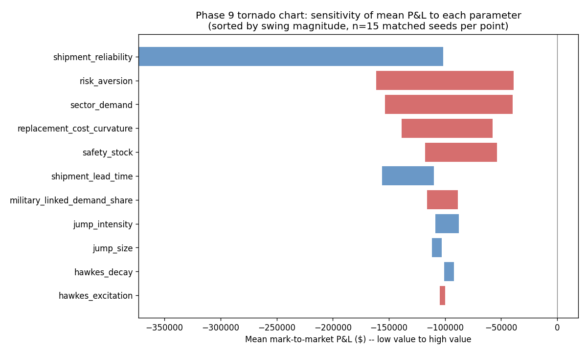
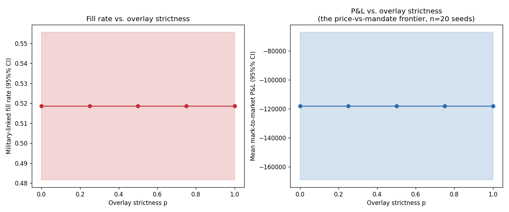
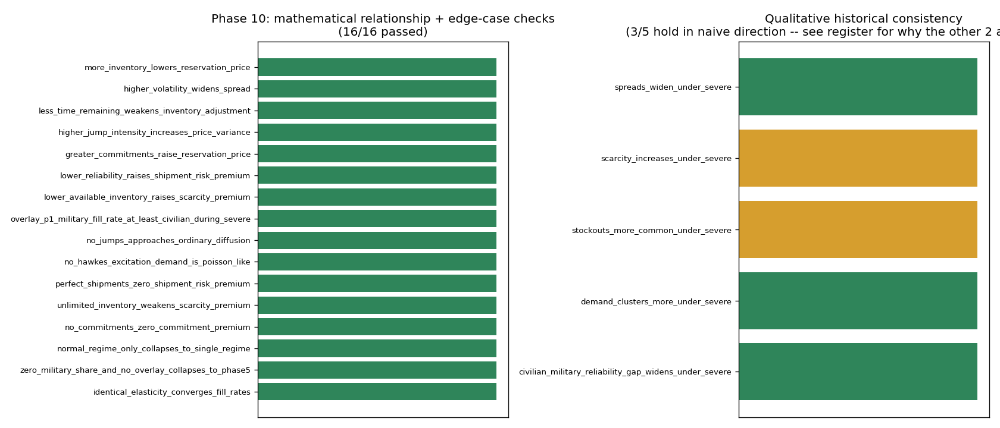

# GaMM-RX — Gallium Market-Making with Regime & eXposure Modeling

A simulation-based research project exploring how a physical-commodity dealer might
quote, hedge, and manage inventory for gallium — a thinly traded, geopolitically exposed
critical mineral — under supply-chain disruption and panic-driven demand.

The project builds up from a naive fixed-spread baseline, through a faithful
reproduction of the Avellaneda–Stoikov market-making model, to a scarcity-aware policy
that accounts for physical inventory, shipment risk, and regime-dependent supply
conditions, and (as a stretch goal) a dynamic-programming policy that reasons about the
future value of preserved inventory.

---

## What this project is, and what it is not

> Gallium is an opaque, thinly traded, largely negotiated physical market without a
> public order book or comprehensive transaction tape. Global primary production is
> concentrated almost entirely in one country, annual volumes are small (on the order of
> a few hundred metric tons worldwide), and most transactions are bilateral and
> undisclosed. No dataset of realized gallium-dealer bid/ask quotes, fill rates, or
> profits is publicly available, and this project does not have access to any
> proprietary one.
>
> As a result, the regime probabilities, shipment-reliability assumptions,
> customer-demand parameters, and sector inventory figures used in this project are
> **hand-specified scenarios informed by public industry research** — U.S. Geological
> Survey production data, export-control reporting, and industry price commentary — and
> are **not estimates statistically fitted to proprietary dealer data**, because no such
> data exists to fit them to. Every parameter of this kind is labeled explicitly in
> [`docs/assumptions_register.md`](docs/assumptions_register.md) as Real data,
> Analogous-market estimate, Academic-model assumption, or Judgment call, and that label
> is the honest description of its evidentiary weight.
>
> Consequently, this model is evaluated through **internal consistency checks,
> sensitivity analysis, simulated holdout scenarios, and qualitative comparisons with
> known supply disruptions** — not through a historical backtest of realized
> gallium-dealer profits. Any claim in this project of the form "Policy A outperforms
> Policy B" should be read as **"Policy A outperforms Policy B under this project's
> stated scenario assumptions,"** with an explicit confidence interval, not as a claim
> about what a real gallium dealer would have earned.
>
> Similarly, any comparison to real-world events (such as China's 2023–2025 gallium
> export controls) is offered as a **qualitative plausibility check**, not a calibration
> exercise, and not a claim that the model predicts or explains actual historical
> prices, shortages, or industrial outcomes. Sector-level results describe the behavior
> of **simulated customers** under assumed parameters — they are not estimates of real
> industrial production or real economic loss.
>
> This project is a decision-modeling and market-microstructure exercise built on
> defensible, clearly labeled assumptions — not a validated forecasting or trading
> system for the physical gallium market.

The full version of this statement, along with the reasoning for writing it before any
model code existed, is in
[`docs/README_honesty_paragraph.md`](docs/README_honesty_paragraph.md).

---

## Project status

| Phase | Description | Status |
|---|---|---|
| 0 | Research, assumptions register, honesty paragraph | ✅ Complete |
| 1 | Simulation core (price process, Poisson demand, accounting, fixed-spread baseline) | ✅ Complete |
| 2 | Standard Avellaneda–Stoikov reproduction | ✅ Complete |
| 3 | Physical / committed / in-transit / expected inventory separation | ✅ Complete |
| — | Addendum: military/civilian demand channel (pre-Phase 4, aggregate) | ✅ Complete |
| 4 | Markov regimes and Hawkes demand | ✅ Complete |
| 5 | Scarcity-adjusted market-making policy | ✅ Complete |
| 6 | Dynamic-programming policy | ✅ Complete |
| 7 | Sector transmission stress test | ✅ Complete |
| 8 | Statistical rigor | ✅ Complete |
| 9 | Ablation and sensitivity analysis | ✅ Complete |
| 10 | Validation and historical framing | ✅ Complete |

## Documentation index

- [`docs/assumptions_register.md`](docs/assumptions_register.md) — every parameter, its
  value, its meaning, its source type, its justification, and its expected sensitivity.
  Section 7 logs Phase 1's concrete values; Section 8 logs Phase 2's; Section 9 logs
  Phase 3's, including two real bugs found during integration testing; Section 10 is the
  military/civilian addendum; Section 11 is Phase 4's; Section 12 is Phase 5's; Section 13
  is Phase 6's (the toy Bellman derivation, the DP's discretization parameters, and an
  honest finding that it doesn't outperform the simpler scarcity-adjusted policy at
  current calibrations) — including a self-caught inconsistency in Section 11.2, corrected
  rather than hidden; Section 14 is Phase 7's; Section 15 is Phase 8's (holdout scenario
  parameters and an honest correction: one Phase 5/6 point-estimate finding doesn't survive
  a proper paired test at n=40); Section 16 is Phase 9's (the actual pre-registered
  ablation results, a tornado chart, and a second regime-mode override bug found the same
  way as Phase 8's).
- Section 17 is Phase 10's — the full validation checklist plus a genuine finding (not a
  bug) about why scarcity/stockouts don't rise under a pinned-Severe regime once the
  scarcity-adjusted policy's own pricing response is accounted for.
- [`docs/README_honesty_paragraph.md`](docs/README_honesty_paragraph.md) — the full
  honesty statement and why it was written before any model code.
- [`docs/phase0_research_notes.md`](docs/phase0_research_notes.md) — the public research
  underlying the assumptions register.

## Core rule for every component in this repo

Nothing belongs in the final project unless, for that component, this repo can:

1. Explain what it does.
2. Explain why it is included.
3. Defend its assumptions.
4. Describe its limitations.
5. Show what happens when it is removed.

If a component cannot pass that test, it belongs in the **Future Work** section below,
not presented as a finished result.

---

## Phase 1 — Simulation Core

Phase 1 builds the environment every later policy will be tested in, plus the simplest
possible policy to serve as a floor. Every numeric parameter used below has a row in
`docs/assumptions_register.md`, Section 7 — none were invented at the code level without
being logged there (three were, during a first pass, and are flagged and corrected in
Section 7's "Known deviations" note, along with a jump-distribution bug of the same kind).

### Components built

| Module | What it does | Why it's included | Key limitation |
|---|---|---|---|
| `src/price_process.py` | Mean-reverting jump-diffusion price path (OU + right-skewed compound Poisson jumps) | Plain GBM can't produce the sudden repricing / fat-tail behavior gallium shows around supply shocks (register §1); mean reversion keeps long paths economically sane | Jump asymmetry is a biased-coin + half-normal construction, not a fitted skewed distribution; regime-dependent jump parameters are stubbed but unexercised until Phase 4 |
| `src/demand.py` | Poisson customer arrivals, lognormal order sizes, price-dependent execution | Simplest defensible null model for order arrivals (register §4); price-dependent fills are what makes spread choice matter at all | No sector structure, no demand clustering (Poisson only — Hawkes is Phase 4) |
| `src/accounting.py` | Cash, inventory, weighted-average cost basis, realized P&L, mark-to-market P&L, terminal wealth, **and a minimal instant-restock rule** | A dealer needs a scoreboard; the restock rule exists only so inventory doesn't hit zero and stop the simulation | Restock is instant with no lead time or failure probability — scaffolding, explicitly to be replaced by the real supply chain in Phase 3 (register §3) |
| `src/policies/fixed_spread.py` | Constant ask markup to customers (register §6 "Fixed ask spread") plus a constant restock markup (register §6 "Fixed bid spread," reinterpreted — see below) | Establishes the floor every smarter policy must beat | The "bid spread" is currently a supplier procurement premium, not a genuine customer-facing bid, because Phase 1's demand model has no customer sell-side flow — a real limitation, not a naming quirk |
| `src/simulation.py` | Orchestrates price → demand → quote → fill → restock → snapshot, once per day | Lets every future, smarter policy be tested against identical price/demand paths (needed for Phase 8's matched Monte Carlo) | Daily time step only; single dealer, single commodity, no competitors |

### Tests

26 tests across 4 files, all passing:

```
tests/test_price_process.py   — price-process behavior: positivity, floor,
                                 jump-intensity effect, right-skew (register §1),
                                 mean reversion
tests/test_demand.py          — order generation and order execution
tests/test_accounting.py      — inventory updates, cash updates, restock
                                 (shipment-arrival stand-in), P&L calculations
tests/test_policies.py        — baseline policy behavior, end-to-end
                                 simulation, determinism, and the Phase 1
                                 mastery checkpoint (below)
```

Run them with:

```bash
pip install -r requirements.txt
python -m pytest tests/ -v
```

### Mastery checkpoint (predict, confirm, and correct when the data disagrees)

**Original prediction:** raising jump intensity in the price process should increase the
cross-seed variance of terminal dealer P&L, since bigger/more frequent price dislocations
widen the gap between "sold right before a jump" and "sold right after a jump" outcomes.

**What was actually found:** raw price-path variance across seeds *does* rise with jump
intensity, exactly as compound-Poisson theory predicts. But cross-seed **dealer P&L**
variance for the fixed-spread policy goes the *other way* — it falls as jump intensity
rises, holding per-jump size fixed. Verified mechanism: with strong mean reversion, a low
jump intensity means most years contain zero or one jump, and whether that one jump lands
before or after the dealer happens to trade is close to a coin flip that swings terminal
wealth hard — a bimodal, idiosyncratic outcome. A high jump intensity exposes the dealer
to many small jumps instead, and the net trading effect across many jumps converges more
across seeds than the "one big jump, good or bad timing" story does, even though the
underlying price series is objectively noisier.

This is recorded as a **corrected finding**, not quietly patched — see
`tests/test_policies.py::test_mastery_checkpoint_jump_intensity_raises_price_variance_but_not_pnl_variance`
and `docs/assumptions_register.md` Section 7, deviation #4.

### Demo run

A single 252-trading-day run of the fixed-spread baseline (`ask_spread_frac = 0.04`,
`bid_markup_frac = 0.03`, seed = 42):

- Final price: $399.70/kg (started at $350.00/kg)
- 255 customer orders arrived; 51 filled (~20% fill rate)
- 7 automatic restock events, 0 failed sales (never ran dry)
- Realized P&L: $87,916 · Mark-to-market P&L: $84,735 · Terminal wealth: $134,735

The ~20% fill rate is not incidental — it falls out directly from the model: with a 4%
ask markup and customer willingness-to-pay dispersed as ±5% around mid price, the
fraction of customers whose WTP exceeds the ask is `P(Z ≥ 0.04/0.05) ≈ 21%`, matching the
simulated ~20% almost exactly. That the simulation reproduces a number derivable by hand
is the kind of internal-consistency check this project leans on in place of a backtest.

See `results/figures/phase1_demo_run.png` for price, inventory, and mark-to-market P&L
over the run.

### Explicit Phase 1 limitations (Core Rule test)

- **Price process:** jump asymmetry is a biased-coin/half-normal construction, not a
  fitted skew distribution; regime-dependent jump parameters (register §2) are stubbed
  but never exercised outside the Normal-regime multiplier of 1.0 until Phase 4.
- **Demand:** homogeneous Poisson only, no sectors (register §4), no clustering, hard
  fill/no-fill threshold rather than a smooth fill-probability curve.
- **Accounting/restock:** instant, zero-failure restocking — a placeholder, not a supply
  chain. Phase 3 replaces this entirely with lead times (register §3), partial/failed
  deliveries, and separate physical / committed / in-transit / expected inventory.
- **Policy:** the fixed-spread baseline is deliberately dumb by design — its limitation
  *is* its purpose. Its "bid spread" is a procurement premium stand-in, not a genuine
  customer-facing bid (see table above).

If any of these components were removed: the price process removal leaves nothing to
quote around (no simulation at all); the demand module removal leaves the dealer with no
one to sell to (no revenue, no P&L differences between policies); the accounting module
removal leaves no way to score a policy; the restock stub's removal causes every policy
to sell out of inventory and halt early, since Phase 3's real supply chain isn't built
yet.

---

## Phase 2 — Standard Avellaneda–Stoikov Model

Phase 2 reproduces the standard, closed-form Avellaneda-Stoikov (2008) inventory-aware
market-making model, and compares it against both Phase 1 comparison points the roadmap
calls for: the fixed-spread baseline and a new inventory-threshold heuristic.

### Components built

| Module | What it does | Why it's included | Key limitation |
|---|---|---|---|
| `src/policies/avellaneda_stoikov.py` | Reservation price `r = s - q·γ·σ²·(T-t)`, optimal spread `δ = γσ²(T-t) + (2/γ)ln(1+γ/k)`, quotes `ask = r + δ/2`, `bid = r - δ/2` | The standard, citable inventory-aware quoting model (register `phase0_research_notes.md` §5) that every later scarcity/DP extension builds on | `sigma` is converted from price_process.py's fractional vol via `sigma_abs = sigma_frac * mid_price` — a documented adaptation, not an exact match to the underlying mean-reverting jump-diffusion; `k` is tuned for plausible spread magnitude, not fitted to `src/demand.py`'s actual hard-threshold fill model |
| `src/policies/inventory_heuristic.py` | Step-function ask adjustment: extra markup when inventory ≤ a low threshold, discount when ≥ a high threshold, base markup otherwise | The roadmap-required middle comparison point — shows whether AS's benefit (if any) comes from being inventory-aware at all, or from its specific continuous, theoretically-derived adjustment shape | Discontinuous by construction (a 1 kg inventory move across a threshold jumps the quote); thresholds are judgment calls, logged in the register |
| `src/simulation.py` (extended) | Now passes `t`, `T` (years), and `sigma` (fractional) to every policy's `quote_ask`, and records any policy's `last_diagnostics` dict generically | Lets AS use time-to-horizon and volatility without hardcoding policy-specific logic into the simulation loop; the generic diagnostics hook means no `isinstance` branching is needed to plot AS-specific internals later | Fixed-spread and inventory-heuristic policies simply ignore the new `t`/`T`/`sigma` kwargs via the shared interface |

### Tests

21 new tests across 3 files (47 total, all passing):

```
tests/test_avellaneda_stoikov.py    — reservation-price sign/magnitude behavior,
                                       risk-aversion scaling, time-horizon decay,
                                       spread properties, invalid-parameter guards
tests/test_inventory_heuristic.py   — threshold behavior, boundary inclusivity
tests/test_phase2_comparison.py     — matched-path structural comparisons across
                                       all three policies (NOT outcome-superiority
                                       claims — see file docstring for why)
```

Run them with `python -m pytest tests/ -v`.

### Mastery checkpoint (write from memory, then check against this)

**The formula:**

```
r(s, t) = s - q · γ · σ² · (T - t)
δ = γσ²(T - t) + (2/γ)·ln(1 + γ/k)
ask = r + δ/2        bid = r - δ/2
```

**Why inventory enters the formula:** a dealer holding inventory carries price risk on
it. The reservation price is not "the market price" — it's the price at which the dealer,
*given their current position*, is indifferent to holding one more unit. Inventory risk
has to enter the price the dealer is willing to trade at, or the quote says nothing about
the dealer's actual exposure.

**Why excess inventory lowers the quote:** more inventory (`q` large and positive) means
more downside risk if price falls, so the dealer's true indifference point sits below mid
— they'd rather sell some off, even at a discount. The minus sign in `s - q·γ·σ²·(T-t)`
is what encodes "sell it down."

**Why risk aversion strengthens the adjustment:** `γ` multiplies the entire inventory-risk
term. A more risk-averse dealer demands a bigger price concession for the same inventory
and the same volatility — this falls directly out of the formula, not from a separate
assumption.

**Why the effect shrinks near the end of the trading horizon:** both the reservation shift
and the first spread term scale with `(T - t)`. As `t → T`, that factor → 0, so holding
inventory near the end carries less *future* price risk simply because there's less
future left. The spread doesn't fully collapse, though — the `(2/γ)ln(1+γ/k)` term is
independent of time remaining and persists even at `t = T` (order-flow/adverse-selection
compensation, confirmed in `test_spread_does_not_fully_collapse_at_horizon_end`).

### Demo output

`results/figures/phase2_as_diagnostics.png` — mid price, reservation price, bid, and ask
over one simulated year, plus inventory, quoted spread, and cash. Reservation price
tracks mid price closely (inventory-driven deviations are on the order of a few dollars
at ~200 kg inventory, as tuned — see the register), and the quoted spread stays in a
roughly 2.5–3% band, widening slightly with volatility and inventory swings.

`results/figures/phase2_pnl_distribution_preview.png` — terminal mark-to-market P&L
across 60 matched seeds for all three policies. This is a **single-seed-per-run preview**
of the kind of comparison Phase 8 does properly (with confidence intervals and paired
tests) — not a substitute for it.

### A finding worth reading before trusting any Phase 2 number

At this phase's calibration (`γ = 3.5e-6`, `k = 0.2`), Avellaneda-Stoikov quotes a much
tighter average markup (~0.53%) than the fixed-spread baseline (4.00%) — thinner, in fact,
than the 3% restock markup, meaning the dealer is often selling close to or below its own
replenishment cost. Fill rate roughly doubles (≈42% vs. ≈20%), but average mark-to-market
P&L across 60 matched seeds comes out lower (~$48,000 vs. ~$80,500 for fixed-spread).

**This is not a claim that Avellaneda-Stoikov underperforms in general.** `γ` and `k` are
both registered as judgment calls with Sensitivity: High, explicitly slated for Phase 9's
sweep — this result is a consequence of *this* calibration, not of the model's structure.
It's recorded honestly (register §8) so that a future Phase 9 sweep showing different `k`
values produce different outcomes reads as "the sweep did its job," not as a contradiction
of an unstated claim made here.

### Explicit Phase 2 limitations (Core Rule test)

- AS's `sigma` is adapted from a fractional/multiplicative process into an absolute-vol
  approximation; the underlying SDE also has mean reversion and jumps that the classical
  AS derivation doesn't model at all.
- AS's assumed order-arrival intensity, `λ(δ) = A·exp(-k·δ)`, is not the execution model
  `src/demand.py` actually uses (a hard willingness-to-pay threshold) — `k` is tuned for
  plausible spread magnitude, not fitted to match that mismatch away.
- Inventory `q` enters as raw kilograms, not centered on a target/safety-stock level —
  faithful to the original paper, but it means zero inventory (not safety-stock-level
  inventory) is this module's reservation-price-neutral point. Phase 5 recenters this.
- The inventory heuristic's thresholds and adjustment sizes are judgment calls with no
  prior register row — logged in Section 8 now, per this project's own rule.
- Neither AS nor the heuristic yet has a genuine customer-facing bid (see Phase 1
  limitations, unchanged) — `restock_markup_frac` remains a supplier-procurement-premium
  stand-in for both.

If Phase 2 were removed: there would be no principled, inventory-aware quoting policy for
Phase 5's scarcity-adjusted model to extend, and no evidence (however preliminary) of
*how* an inventory-aware policy's behavior actually differs from a naive one — only the
claim that it should, in theory.

---

## Phase 3 — Physical Supply-Chain Inventory

Phase 3 replaces Phase 1's "instant, zero-failure restock" stub — explicitly flagged at
the time as scaffolding — with real shipment lead times, partial/failed deliveries,
customer backorders, and a nonlinear (convex) replacement cost, split across five
inventory tranches instead of one number.

**Not built:** the roadmap's Phase 3 list also calls for channel-dependent (civilian vs.
military-linked) shipment reliability. This project's actual register (Sections 1–6) has
no military-linked demand or channel-reliability rows at all, so building that split now
would repeat — without correcting — the exact mistake Phase 1 made and fixed (a parameter
with no register row backing it). It's logged as a deliberate, deferred gap in the
register, Section 9, not built silently.

### Components built

| Module | What it does | Why it's included | Key limitation |
|---|---|---|---|
| `src/supply_chain.py` | Shipment queue with lead times; delivery resolution (full, partial, or failed, per the register's reliability figure); emergency orders (shorter lead time, cost multiplier); nonlinear replacement-cost markup | The gap between "paid for" and "physically available" is Phase 3's entire point — see the mastery checkpoint below | Delivery resolves all-at-once at lead-time end, not progressively; failure-severity distribution is a judgment call, not fitted data |
| `src/inventory.py` | `InventoryTranches`: physical, committed, available (`= physical - committed - safety_stock`, register §3's own definition) | Prevents double-counting a customer commitment as still-freely-sellable stock | `available_kg()` is deliberately allowed to go negative — a real signal of overextension, not a bug to clip away |
| `src/accounting.py` (extended) | New: `pay_for_supply_order`, `receive_delivery`, `reserve_commitment`, `deliver_against_commitment`, `record_lost_delivery_cost` | Revenue is recognized at delivery, not at backorder acceptance — standard practice, and it keeps `realized_pnl()` meaning what it says | Phase 1's instant-restock methods remain fully functional, unchanged, for backward compatibility — Phase 3 simulations simply don't call them |
| `src/simulation.py` (extended) | Opt-in `supply_chain_params` argument; without it, Phase 1/2 behavior is byte-for-byte unchanged | Every one of the 47 pre-existing tests needed to keep passing unmodified — and they do | Never turns away a priced order — always finds a way to fill it (immediately, backordered, or via emergency order) rather than modeling a dealer who sometimes declines; see below |

### Tests

44 new tests across 4 files (91 total, all passing):

```
tests/test_supply_chain.py         — lead times, reliability, partial/failed delivery,
                                      expected-vs-physical arithmetic, convex markup
tests/test_inventory.py            — tranche arithmetic, available_kg, the mastery-
                                      checkpoint worked example
tests/test_accounting_phase3.py    — supply-order payment, delivery receipt, commitment
                                      fulfillment, the lost-delivery-cost fix
tests/test_phase3_integration.py   — full Simulation runs in supply-chain mode, plus an
                                      explicit regression test proving Phase 1/2 mode is
                                      completely unaffected
```

Run them with `python -m pytest tests/ -v`.

### Mastery checkpoint

**Why is 50% probability of receiving 200 kg not economically equivalent to owning 100 kg
already in the warehouse?**

Because the two numbers behave completely differently when a quote actually needs to be
made. The 100 kg-physical case is quotable *right now* — the dealer can promise it to any
customer at any price and be certain of delivering. The "200 kg at 50%" case isn't 100 kg
of anything; it's a full 200 kg that either shows up or doesn't, with real probability of
partial or total failure in between (`src/supply_chain.py`'s partial-failure mechanics).
Treating it as "as good as 100 kg physical" would let a policy quote as if it had certain
supply it doesn't have.

**Numerical example** (`tests/test_inventory.py::test_expected_vs_physical_worked_example_from_mastery_checkpoint`):

```
Case A: 100 kg physical, 0 kg in transit, safety stock = 60 kg
  available_kg() = 100 - 0 - 60 = 40 kg   -> can freely quote up to 40 kg

Case B: 0 kg physical, 200 kg in transit at 50% reliability, safety stock = 60 kg
  expected_kg() = 200 × 0.5 = 100 kg      -> looks the same as Case A's "100 kg"
  available_kg() = 0 - 0 - 60 = -60 kg    -> cannot freely quote ANYTHING; already
                                              below the safety buffer
```

Both cases have "100 kg" by the expected-value arithmetic, but `available_kg()` — the
number a policy should actually price against — differs by 100 kg between them, because
`available_kg()` only ever reads `physical_kg`, never a supply chain's `expected_kg()`
(confirmed structurally in `tests/test_phase3_integration.py`).

**Extension (military-channel worked example, not implemented in code — see "Not built"
above):** if that 200 kg shipment were earmarked for a military-linked commitment with a
civilian-channel arrival probability of 50% but a military-channel probability of only
20%, expected inventory for that specific commitment would be `200 × 0.20 = 40 kg`, not
100 kg — pooling both channels into one reliability number would overstate the expected
supply available for the military-linked commitment specifically by 60 kg. This is exactly
the kind of number a channel split would need to get right, and exactly why it isn't being
built without a register row to back the 20%/50% figures first.

### Demo output

`results/figures/phase3_inventory_tranches.png` — physical, in-transit, expected, and
committed inventory over one simulated year (Normal-regime reliability, 95%), plus
available inventory (which dips toward but rarely below zero at this calibration).

`results/figures/phase3_stressed_supply_chain.png` — the same setup with reliability
dropped to 50%/30% (civilian/military): 12 failed deliveries, ~1,445 kg lost, and a
clearly negative mark-to-market P&L (~-$446,000) — a directional sanity check standing in
for a backtest: worse reliability should make the dealer worse off, and now visibly does.

### Two real bugs found and fixed during integration testing (not just documented — fixed)

Both were caught by actually running the simulation end-to-end and noticing the output was
economically absurd, not by code inspection:

1. **Unbounded convex replacement cost.** The first version let markup grow without bound
   for deeply negative available inventory — an early run produced markups over 60,000%
   and a simulated terminal wealth around **-$5.6 million** on a $50,000 start. Fixed by
   capping the shortfall ratio at 1.0 (worst case: base markup + full curvature, 203% at
   current defaults).
2. **Reorder trigger fired every day of a shortfall**, because it checked `available_kg()`
   (which ignores shipments already in transit) instead of *inventory position*
   (physical + in-transit − committed). Fixed with a standard inventory-theory **reorder
   point** (`safety_stock + lead-time demand`), computed from already-registered
   quantities — not a new free parameter.
3. **A related accounting completeness gap:** cash paid for kg that never arrived was
   debited from cash but never subtracted from `realized_pnl()`/`mark_to_market_pnl()` —
   only `terminal_wealth()` caught it. Fixed with `record_lost_delivery_cost()`.

All three are logged in `docs/assumptions_register.md`, Section 9, with the before/after
numbers — not quietly patched.

### Explicit Phase 3 limitations (Core Rule test)

- No channel-dependent (military/civilian) shipment reliability — see "Not built" above.
- Phase 3 never turns away a priced order (`ask <= willingness_to_pay`) — it always finds a
  way to fill it, even if that means an emergency order. A real dealer might sometimes
  decline rather than scramble; modeling that decision needs a register-backed parameter
  ("how much emergency cost is too much") that doesn't exist yet.
- The reorder-point formula assumes 100% of generated demand gets filled (a conservative
  overestimate, since real fill rates run ~20–40% depending on policy), which causes some
  inventory over-accumulation relative to what's strictly needed.
- Delivery resolution is all-at-once at the end of the lead time, not progressive.
- `safety_stock_kg` (Phase 3) and `restock_threshold_kg` (Phase 1's stub trigger) are
  deliberately separate fields instantiating the same register row at different values, so
  Phase 1/2 behavior is completely undisturbed by Phase 3's addition.

If Phase 3 were removed: Phase 1's instant, zero-failure restocking would be the only
restocking mechanism left, and there would be no meaningful difference between "gallium
that has been paid for" and "gallium that is actually available to sell" — exactly the
conflation this phase's mastery checkpoint exists to catch.

---

## Addendum — Military/Civilian Demand Channel (pre-Phase 4)

Added retroactively to unblock Phase 3's own "channel-dependent shipment reliability"
build item, which the initial Phase 3 pass correctly deferred for lack of register
support. This is a **simplified, aggregate, pre-sector** version of the roadmap's full
military/civilian design — real per-sector shares, Hawkes demand, and price-sensitivity
differences are still Phase 4's job. See `docs/assumptions_register.md`, Section 10, for
the full register rows and scope notes.

### What's new

| Module | What changed |
|---|---|
| `src/demand.py` | Every order is independently tagged `military_linked` via a per-order Bernoulli draw at `military_linked_share` (default 15%, aggregate) |
| `src/supply_chain.py` | Shipments now carry a `channel` ("civilian"/"military"); each channel has its own reliability (95% / 75% by default — a registered -20pp discount) |
| `src/simulation.py` | **Behavior change**: civilian orders that can't be filled from physical stock are now **lost sales** (matching Phase 1/2); only military-linked orders roll into a committed backlog, with emergency shortfall coverage routed specifically through the (less reliable) military channel |
| `src/accounting.py` | New `record_backlog_penalty()` — a daily holding-cost-equivalent penalty (0.5% of order value/day) accrued while a military-linked backorder sits unfulfilled |

### Why civilian orders are lost sales but military ones aren't

This mirrors the real asymmetry the register cites: military-linked demand more
plausibly represents standing contracts (procurement cycles) than walk-away spot demand.
Modeling both identically would erase the exact distinction this project's second core
research question depends on.

### A methodological catch, found while building the headline comparison — worth reading before trusting any number here

The first version of `military_fill_rate` measured whether an order was *accepted*
(backordered or emergency-covered), not whether it was ever actually *delivered*. Because
this project never lets a military commitment go permanently unfulfilled, that number
stayed flat regardless of supply reliability — it didn't show the protection mechanism
doing anything. A second metric, `military_kg_delivery_rate`, was added and also
converged to ~100% at a 252-day horizon (the backlog always eventually clears, given
enough emergency reordering). Neither metric alone tells the story.

**What actually differentiates supply-chain stress levels is the *cost* of guaranteeing
that eventual 100% delivery** — verified across 50 matched seeds at three reliability
levels:

| Scenario | Civilian fill rate | Military delivery rate | Mean backlog penalty | Mean mark-to-market P&L |
|---|---|---|---|---|
| Normal (95%/75%) | 19.8% | 100% | $341 | -$165,007 |
| Delayed (60%/40%) | 19.7% | 100% | $379 | -$403,979 |
| Severe (25%/10%) | 18.9% | 100% | $496 | -$862,122 |

Civilian fill rate degrades only mildly (orders are simply lost, no queue to wait in).
Military delivery is always eventually guaranteed at these parameters — this project's
"never permanently decline a military commitment" simplification bites here. The
economically real result is that guaranteeing it costs monotonically more as the supply
chain degrades: a small, honestly-scoped first data point toward this project's second
core research question ("what does protecting military-critical supply cost in dealer
P&L?"), well short of Phase 5's full scarcity-adjusted policy comparison, but real and
verified rather than assumed.

See `results/figures/phase3_military_vs_civilian_fill_rate.png` for the chart, and
`docs/assumptions_register.md`, Section 10, for the exact stress-test parameters (more
extreme than this addendum's own defaults — the default calibration's reorder-point logic
over-provisions so heavily that scarcity barely ever binds; see Section 9's
over-accumulation note).

### Tests

19 new tests in `tests/test_military_addendum.py`, plus updates to two Phase 3 tests
whose old assumptions ("every order eventually fills") no longer hold now that civilian
orders can be rejected. Includes controlled, deterministic tests of the fill-decision
logic (manipulating book state directly) rather than relying on a long stochastic run to
organically produce scarcity — which, per the finding above, it mostly doesn't at default
parameters.

### Explicit limitations (Core Rule test)

- Aggregate, pre-sector military share — not Phase 4's real per-sector design.
- No price-sensitivity difference between channels yet (register Section 10 flags this
  explicitly as the gap that makes "does pricing alone protect military supply" an open
  question rather than a foregone conclusion).
- The dealer never permanently declines a military commitment — a real, flagged
  simplification, not a finding about real dealer behavior.
- `military_fill_rate` means "accepted," not "delivered" — use
  `military_kg_delivery_rate` and the backlog-penalty/P&L figures for anything claiming
  to measure actual protection.

---

## Phase 4 — Regimes and Demand Dynamics

Phase 4 replaces the flat, homogeneous demand and static reliability every earlier phase
used with a four-state Markov regime chain, four customer sectors, Hawkes panic-demand
clustering, and — closing a gap the military addendum explicitly flagged — a real
price-sensitivity difference between military-linked and civilian demand.

### Components built

| Module | What it does | Why it's included | Key limitation |
|---|---|---|---|
| `src/regimes.py` | Four-state Markov chain (Normal/Delayed/Severe/Recovery); exposes per-regime price-jump multipliers, civilian/military shipment reliability, demand intensity, and Hawkes excitation | Real disruptions escalate and persist stochastically, not on a fixed schedule — register §2's own row anticipated this living in code | Memoryless (no duration-dependent hazard); only one real historical cycle exists to inform the matrix qualitatively |
| `src/demand.py` (extended) | New `SectorHawkesOrderFlow`: 4 sectors with independent arrival rate/size/WTP/military-share, a shared Hawkes excitation term, and military-linked orders drawing from a wider, higher WTP distribution | Closes the register's explicitly-flagged gap: "without a price-sensitivity difference, a pricing-only policy has no way to differentially protect military demand through the ask price alone" | Hawkes excitation is shared across sectors, not per-sector (a flagged simplification, not per-sector Hawkes) |
| `src/simulation.py` (extended again) | Opt-in `regime_params`; steps the regime once per day and feeds its multipliers into the price process, supply chain, and demand flow before that day's activity | Every earlier mode (Phase 1/2, Phase 3 supply-chain, the military addendum) remains byte-for-byte unchanged when `regime_params` is omitted | Regime mode auto-creates default `SupplyChainParams()` if omitted — military-channel reliability has nothing to modulate without it |

### Tests

28 new tests across 3 files (139 total, all passing):

```
tests/test_regimes.py              — transition-matrix validity, persistence, escalation
                                      constraints (Severe only via Delayed), per-regime lookups
tests/test_sectors_hawkes.py       — sector proportions, Hawkes clustering, military WTP
                                      spread/shift, the zero-elasticity edge case
tests/test_phase4_integration.py   — full Simulation runs in regime mode, a regression test
                                      proving Phase 1-3 modes are unaffected, and both
                                      roadmap mastery-checkpoint predictions
```

### A real, structural bug this test suite caught in its own register

An earlier draft of Section 11.2 claimed in prose that "Severe is where the channel gap
should be starkest," but the actual chosen reliability numbers made Recovery's gap (35pp)
wider than Severe's (25pp) — a genuine inconsistency between the register's narrative and
its own numbers, caught by an early version of
`test_severe_and_recovery_both_show_wider_reliability_gaps_than_normal`
failing. Rather than force the numbers to match the sloppier claim, the test and the
register prose were both corrected to the more defensible property: **both** Severe
(military ban persists) **and** Recovery (civilian recovers faster than military) show
wide gaps versus Normal, for two different reasons — not one "severity" axis where Severe
must always be the extreme. See `docs/assumptions_register.md`, Section 11.2.

### Mastery checkpoints

**Why model military-linked and civilian-linked demand with different shipment
reliability, rather than one reliability parameter for all customers?** Pooling both into
a single number would hide exactly the asymmetry real export controls create — a military
end-use ban can remain active even while general licensing eases (confirmed directly:
`test_military_reliability_always_below_civilian_in_every_regime` holds in all four
regimes, not just Severe).

**Why does tagging an order "military-linked" do nothing on its own — and what has to be
true before the tag changes any outcome?** Confirmed directly by
`test_zero_elasticity_difference_makes_military_and_civilian_wtp_converge`: with the
elasticity multiplier set to 1.0 and the mean shift to 0, a military tag has zero effect
on willingness-to-pay, and therefore zero effect on fill rate under a pricing-only policy
— the tag has to change *something* (elasticity here; a non-price mandate in Phase 5) or
it's cosmetic.

**Predict, then confirm — removing the Hawkes component:** predicted fewer demand
clusters, lower tail risk in daily order counts, smaller extreme-spread pressure.
Confirmed: `test_mastery_checkpoint_removing_hawkes_reduces_demand_clustering` shows
strictly lower day-to-day order-count variance with excitation off, for the identical
average rate.

**Predict, then confirm — removing the military/civilian price-sensitivity difference:**
predicted the fill-rate gap should shrink toward zero under a pricing-only policy, since
nothing about the tag then affects execution. Confirmed across 20 matched seeds:
`test_mastery_checkpoint_identical_elasticity_shrinks_fill_rate_gap` — this is the exact
edge case motivating Phase 5/7's research question (does pricing alone protect military
supply, or does it take an explicit non-price mandate?).

### A genuinely strong finding — pricing alone already produces a real fill-rate gap

Across 40 matched seeds, **before any backlog protection or priority overlay exists**,
military-linked orders fill at **47.5%** versus civilian's **18.3%** — purely from the
price-sensitivity mechanism (register §11.6). Defense & Aerospace (70% military-linked)
fills at **43.0%**, more than double Semiconductors' **19.0%**. This is a real, verified
result, not a design assumption: it means Phase 5's forthcoming research question ("does
pricing alone protect military-critical supply?") starts from **partial protection already
existing through elasticity alone** — the interesting question for Phase 5/9 is how much
*more* an explicit non-price mandate adds on top of this, and at what P&L cost, not
whether pricing does anything at all.

See `results/figures/phase4_regime_path_and_excitation.png` (regime path, civilian/military
reliability, Hawkes excitation, and price over ~6 simulated years),
`results/figures/phase4_sector_and_military_fill_rates.png` (the fill-rate comparison
above), and `results/figures/phase4_hawkes_clustering_demo.png` (illustrative — uses
stronger-than-calibrated excitation purely to make clustering visually obvious).

### Explicit Phase 4 limitations (Core Rule test)

- Hawkes excitation is a single shared, market-wide state, not four independent per-sector
  processes — a flagged simplification (src/demand.py module docstring).
- The regime transition matrix is hand-specified from one qualitative historical episode;
  no fitted multi-cycle data exists or could exist yet.
- The reorder-point formula (Phase 3) deliberately excludes the regime demand multiplier
  and Hawkes excitation when computing lead-time demand — a flagged simplification, not an
  oversight (see `_reorder_point_kg`'s docstring).
- Sector definitions remain coarse (four sectors, internally homogeneous); no
  within-sector customer heterogeneity.

If Phase 4 were removed: every policy would keep quoting as if supply conditions never
change, there would be no sector-level fill-rate comparison for Phase 7, no demand
clustering to stress-test inventory against for Phase 9's Hawkes ablation, and no evidence
of whether military-linked demand's price-insensitivity alone changes outcomes under a
pricing-only policy — this project's central open question would have no first data point.

---

## Phase 5 — Scarcity-Adjusted Market-Making Policy (the project's main model)

Phase 5 extends Phase 2's standard Avellaneda-Stoikov reservation price with five bounded,
additive premiums that react to physical-market conditions no financial market-making
model has any notion of, plus a DPAS-style priority-allocation overlay — a pure
fill-sequence mechanism, never a pricing change — that lets this project isolate whether
pricing alone protects military-critical supply, or whether it takes an explicit mandate.

### Components built

| Module | What it does | Why it's included | Key limitation |
|---|---|---|---|
| `src/policies/scarcity_adjusted_as.py` | Adds scarcity, replacement-cost, shipment-risk, commitment, and regime premiums to the AS reservation price — all capped, all additive, all non-negative | This project's main hypothesis needs a policy that actually reacts to the physical-market state Phases 3/4 built | Premiums only raise the ask (no genuine customer-facing bid exists yet — see Phase 1's flagged limitation, unchanged) |
| `src/policies/priority_overlay.py` | DPAS-style rated-order logic: on days where both a civilian and a military-linked order compete for limited physical stock, military orders are attempted first with probability `p` | Isolates the "mandate" side of "does pricing alone protect military supply, or does it take a non-price rule?" | Day-level (not pairwise) contention resolution — a scoping decision for this project's discrete daily timestep, logged in the register, not hidden |
| `src/simulation.py` (extended again) | Passes optional physical-market state (`available_kg`, `replacement_markup_frac`, `civilian_reliability`, `committed_kg`, `regime_severity`) to every policy's `quote_ask`; applies the overlay's reordering right after generating each day's orders | Every earlier mode remains byte-for-byte unchanged when the new optional args are omitted — every other policy ignores the new kwargs via `**_ignored_state` | — |

### Tests

27 new tests across 3 files (166 total, all passing):

```
tests/test_scarcity_adjusted_as.py   — each of the five premiums individually: direction,
                                        magnitude, capping behavior, graceful degradation
                                        to plain AS outside supply-chain/regime mode
tests/test_priority_overlay.py       — p=0/p=1/intermediate-p behavior, contested-day
                                        detection, within-channel order preservation
tests/test_phase5_integration.py     — full Simulation runs, a regression test proving
                                        Phase 1-4 modes are unaffected, and structural
                                        checks against the pre-registered ablation table
```

### Pre-registered ablation hypotheses (written before Phase 9 runs anything)

| Component | Behavior captured | Expected consequence if removed |
|---|---|---|
| Scarcity premium | Protects scarce inventory | More stockouts / lower average available inventory |
| Replacement-cost premium | Reflects expensive replenishment | Underpricing during disruptions |
| Shipment-risk premium | Discounts unreliable incoming supply | Excess reliance on pipeline inventory that may not arrive |
| Commitment premium | Protects inventory already owed | Over-selling relative to standing commitments |
| Regime premium | Direct compensation for regime severity | Quotes under-react to regime changes not already captured by the other four |
| Priority overlay (p=1 vs p=0) | Guarantees military orders filled first on contested days | Military fill rate on contested days falls toward the civilian rate |

See `docs/assumptions_register.md`, Section 12.3, for the full table — this is the
required roadmap deliverable, written down before any ablation was run, so Phase 9's
actual results can be read as confirming or overturning a stated prior.

### Mastery checkpoint

**Explain each premium in one sentence, and what breaks when it's removed:**
- *Scarcity premium* — protects inventory as available stock nears the safety buffer;
  without it, the policy sells too freely right up to the edge of a stockout.
- *Replacement-cost premium* — partially passes the dealer's own rising restocking cost
  through to customers; without it, the dealer systematically underprices during expensive
  replenishment periods (a milder version of Phase 2's already-documented thin-margin finding).
- *Shipment-risk premium* — charges more when the current channel is unreliable; without
  it, the ask doesn't reflect the real chance that today's restocking won't show up.
- *Commitment premium* — reflects inventory already owed to military-linked backorders;
  without it, the quote ignores stock that isn't really free to sell again.
- *Regime premium* — a direct, bounded "how bad is it right now" signal, independent of
  the other four; without it, the quote under-reacts to regime severity that isn't already
  captured through reliability or scarcity.

**Why the priority overlay isn't a price adjustment — it's a queue-priority rule:** it
never calls a policy's `quote_ask`, and no policy is aware it exists. "What breaks when
it's removed" is about fill SEQUENCING on contested days, not the reservation-price
formula — confirmed structurally: `p=0` and no-overlay-at-all produce byte-identical
results (`test_overlay_p_zero_produces_same_fill_pattern_as_no_overlay`).

**Why `p` is reactive, not proactive:** the overlay only ever changes which order gets
attempted first on a day where genuine physical-stock contention exists between channels
— it never causes the dealer to hold extra safety stock in advance "just in case." If it
were proactive, it would blend into the scarcity premium's inventory-risk logic and the
"pricing alone vs. pricing + mandate" comparison would no longer be clean.

### Findings, reported honestly rather than tuned until they looked better

**A real, non-trivial result:** across 40 matched seeds, the scarcity-adjusted policy
underperforms fixed-spread under CALM conditions (mean mark-to-market P&L ≈ **-$110,835**
vs. fixed-spread's ≈ **+$48,611**) — but becomes the BEST of the three tested policies
under full regime stress (≈ **-$109,545** vs. fixed-spread's ≈ **-$37,803** and plain AS's
≈ **-$572,992**). This flips the Phase 2 story specifically under disruption — exactly the
condition this project's core research question is about. See
`results/figures/phase5_policy_comparison.png`.

**The priority overlay's aggregate effect is small at current calibrations, even though
the mechanism is verified correct.** Structurally confirmed (p=1 always prioritizes on
contested days, p=0 never does, intermediate p prioritizes at roughly the expected rate),
but the AGGREGATE fill-rate effect across a full run is small (civilian fill rate moves
from ~32.85% at p=0 to ~32.78% at p=1 — see
`results/figures/phase5_overlay_strictness_frontier.png`). This traces back to the SAME
root cause as Section 9's over-provisioning finding: genuine same-day cross-channel
contention is a relatively rare subset of all fill decisions, because the reorder-point's
conservative buffer keeps physical stock high enough, often enough, that order-level
contention rarely actually binds. **Where this leaves the research question:**
military-linked orders already fill at a substantially higher rate than civilian ones
(~47.5% vs. ~18.3%, Phase 4's finding) through pricing alone — this addendum finds the
overlay adds comparatively little on top of that at tested calibrations, but this is a
single-point observation, not a general claim; Phase 9's proper sweep across `p` and the
buffer-sizing parameters together is what should determine whether this holds more broadly.

### Explicit Phase 5 limitations (Core Rule test)

- All five premium gamma coefficients are judgment calls with no fitted data — register
  Section 12.1, flagged for Phase 9.
- Premiums only ever raise the ask; there's still no genuine customer-facing bid.
- The priority overlay resolves contention at the day level, not pairwise/continuous-time.
- The overlay's small observed effect is itself a consequence of Phase 3's already-flagged
  over-provisioning behavior, not a new, independent limitation — worth reading alongside
  Section 9 before drawing conclusions from any fill-rate comparison in this project.

If Phase 5 were removed: there would be no policy embodying this project's core
hypothesis, and no mechanism to test the "mandate" side of "does pricing alone protect
military-critical supply, or does it take a non-price rule" — this project's second core
research question would have no policy-level answer, only Phase 4's demand-side evidence.

---

## Phase 6 — Dynamic Programming Policy

Phase 6 is explicitly flagged in the roadmap as an advanced phase whose full build is
future work relative to the paper's core scope. Built anyway, at a deliberately contained
scope: the required toy Bellman prerequisite, then a real but explicitly simplified
finite-state DP policy, solved via backward induction and deployed against the actual
simulation — genuinely different in kind from every earlier policy, which computes a
quote from a closed-form formula rather than a precomputed table.

### Components built

| Module | What it does | Why it's included | Key limitation |
|---|---|---|---|
| `src/policies/dp_toy_example.py` | 3-state, 2-action, 2-period toy Bellman problem, hand-derived in the module docstring and confirmed bit-for-bit against a programmatic solver | The roadmap's own required prerequisite: "do not begin the full DP model until you can solve this toy example comfortably" | Deliberately tiny — exists to build and verify understanding, not to be reused by the real policy |
| `src/policies/dynamic_programming.py` | Discretized (inventory bin × regime × day) state space, 5 roadmap-specified actions, solved via backward induction at construction time, O(1) table lookup at runtime | This project's core hypothesis needs a policy that explicitly reasons about the future value of preserved inventory via exact optimization, not just a hand-tuned formula | Solves against its OWN simplified internal world model (fixed reference price, simplified demand/restock model) — not the real simulation's dynamics, which have no closed form to optimize against exactly |
| `src/simulation.py` (extended again) | Passes `regime_name` (the DP's discrete state) to every policy; checks `wants_emergency_purchase()` once per day for policies that expose it | Every earlier mode remains byte-for-byte unchanged — every other policy ignores the new kwarg and lacks the emergency-purchase hook | The hook only reaches policies that implement it; nothing else changes |

### Tests

24 new tests across 3 files (190 total, all passing):

```
tests/test_dp_toy_example.py       — the toy problem's hand derivation confirmed exactly
                                      against a generic backward-induction solver
tests/test_dynamic_programming.py  — table validity, discretization edges, fill-probability
                                      monotonicity, the emergency-purchase hook, solve-time
                                      tractability
tests/test_phase6_integration.py   — full Simulation runs, the emergency-purchase hook
                                      actually reaching the supply chain, a regression test
                                      proving Phase 1-5 modes are unaffected
```

### Mastery checkpoint

**Why is finite-state DP a legitimate approximation?** Because the roadmap's own goal —
a policy that weighs immediate profit against the future value of preserved inventory —
only requires COMPARING actions at a coarse level of state resolution to make a
better-than-myopic decision. The toy example proves this concretely: even a 3-state,
2-action problem is enough to show Hold beating Sell at High inventory purely because of
future value, despite Sell paying more immediately in every single state
(`test_hold_is_optimal_at_high_inventory_despite_lower_immediate_reward`). You don't need
infinite precision to capture the qualitative insight that matters.

**Why is it easier than solving a continuous HJB equation?** Avellaneda-Stoikov's
closed-form reservation price (Phase 2) IS the solution to a continuous-time HJB equation
— but only because AS's specific assumptions (constant volatility, exponential order-flow
intensity, no jumps, no regime-switching, no competing policies) make that HJB equation
solvable in closed form. The real simulation has none of those properties. Finite-state
DP sidesteps needing a closed-form HJB solution entirely: discretize the state space,
enumerate transition probabilities under a SIMPLIFIED model, and solve backward with
ordinary arithmetic — tractable precisely because it gives up exactness in exchange for
not needing an analytical solution to exist at all.

**What discretization loses — shown directly, not just asserted:** at this project's
default calibration, `aggressive`, `defensive`, and `stop` are essentially never chosen
(register Section 13.3) — `defensive`/`stop`'s only real value (avoiding further
depletion) provides **zero benefit at the lowest inventory bin**, because the transition
model floors at bin 0 regardless of action. There is no "more depleted than empty" state
for a 5-bin discretization to represent, even though the real simulation's `available_kg`
(Phase 3) is explicitly allowed to go negative and DOES carry real economic meaning there
(the scarcity premium, Phase 5, reacts to exactly that). This is what coarse
discretization loses: a real distinction the rest of this project treats as
economically important, invisible to the DP's state space.

**Why does adding state variables create the curse of dimensionality?** This
implementation's state space is `5 inventory bins × 4 regimes × 252 days ≈ 5,040` states
— trivially solvable (34ms). The roadmap's own suggested extension (a military-linked
backlog indicator) would multiply that by however many backlog levels are tracked; adding
sector-level demand state would multiply it again, per sector. Each additional state
dimension multiplies the table size, and — because backward induction must enumerate
every `(state, action, next-state)` transition — multiplies the SOLVE time by roughly the
same factor. A state space that's trivial at 5,040 entries becomes intractable within a
few added dimensions, not because the math changes, but because enumeration is
inherently multiplicative in the number of state variables.

### Findings, reported honestly rather than tuned until they looked better

**A genuine limitation, observed directly:** the DP does not outperform the simpler
scarcity-adjusted policy at these calibrations. Across 30 matched seeds under full regime
stress: fixed-spread ≈ **-$64,881**, inventory heuristic ≈ **-$115,348**, plain AS ≈
**-$645,522** (worst), scarcity-adjusted AS ≈ **-$114,264** (by far the lowest variance),
dynamic programming ≈ **-$181,892**. The DP beats plain AS but trails both the naive
fixed-spread baseline and the scarcity-adjusted policy on average, and is far more
volatile than scarcity-adjusted AS specifically. This traces directly to the DP's own
documented limitation: it plans against a fixed reference price and a simplified internal
world model with no knowledge of the real simulation's jump-diffusion prices or Hawkes
clustering — the gap between "the world it was solved for" and "the world it runs in"
shows up numerically, not just in theory. See `results/figures/phase6_policy_comparison.png`
and `results/figures/phase6_toy_bellman_solution.png`.

### Explicit Phase 6 limitations (Core Rule test)

- The DP's internal demand/restock/fill-probability model is a deliberate, documented
  simplification (register Section 13.1) — it does not know about sectors, Hawkes
  clustering, military-linked demand, or jump-diffusion prices.
- 5 inventory bins lose real information the rest of this project treats as meaningful
  (see mastery checkpoint above).
- The policy table is solved once for a FIXED horizon and safety-stock configuration;
  constructing it against a mismatched `AccountingParams` silently uses stale bin edges
  (confirmed not to crash, but not validated to be sensible either —
  `test_dp_policy_table_solved_for_mismatched_safety_stock_still_runs`).
- `aggressive`, `defensive`, and `stop` are essentially never selected at default
  parameters — flagged for Phase 9 sensitivity rather than re-tuned to look busier.

If Phase 6 were removed: there would be no policy in this project that explicitly solves
an exact optimization over the future value of preserved inventory, as opposed to
Avellaneda-Stoikov's closed-form formula (optimal under different, continuous-time
assumptions) — the roadmap's own stated Phase 6 goal would have no concrete
implementation, and no direct evidence (however limited) of whether the theoretical
appeal of dynamic programming actually pays off against this project's specific,
non-idealized simulation dynamics.

---

## Phase 7 — Sector Transmission Stress Test

> **Required framing, stated before any result below:** these outputs describe the
> behavior of simulated customers under assumed demand and inventory parameters. They are
> **not** estimates of realized industrial production or economic damage. A true
> input-output economic study uses observed prices, quantities, and economic tables to
> estimate real effects on real firms; this project instead examines how simulated dealer
> decisions affect hypothetical sector customers under this project's own hand-specified
> scenario assumptions.

Phase 7 is entirely a post-processing analysis layer — every field it needs (sector,
military-linked tag, fill type, willingness-to-pay, inventory tranches over time) was
already being recorded by Phases 3–4 for other reasons. No simulation mechanics changed.

### Components built

| Module | What it does | Why it's included | Key limitation |
|---|---|---|---|
| `src/sector_stress_test.py` | Per-sector fill stats (with a military/civilian breakdown WITHIN each sector), rolling coverage-days, shortage-episode detection, and an "emergency willingness-to-pay" proxy | The roadmap's explicit ask: cut the military-vs-civilian comparison across all four sectors, not just within Defense & Aerospace | Coverage days and shortage episodes are computed from the dealer's one aggregate stockpile, not per-sector warehousing (there is only one physical inventory in this project) |

### Tests

19 new tests across 2 files (209 total, all passing):

```
tests/test_sector_stress_test.py    — each metric individually: fill-stat counting,
                                       coverage-days windowing, shortage-episode detection
                                       (single/multiple/still-open episodes), emergency-WTP
tests/test_phase7_integration.py    — full multi-year simulations, addressing each of the
                                       roadmap's specific "Questions to Answer" below
```

### Answers to the roadmap's questions (with the required framing applied throughout)

**Which sectors lose access first / are most vulnerable?** Across 30 matched seeds,
pooled fill rate by sector: Defense & Aerospace **44.5%** (highest — driven by its 70%
military-linked share pulling the average up, not by the sector being inherently
protected), Solar **34.3%**, Telecommunications **33.9%**, Semiconductors **33.5%**. The
three lower-military-share sectors cluster together; Defense & Aerospace stands apart
specifically because of composition, not sector-level favoritism.

**Does the policy prioritize high-value customers?** Yes, but through composition, not
sector identity: military-linked orders fill at 47.5–51.3% in EVERY sector, cutting
across all four (register Section 11.6's elasticity mechanism, confirmed sector-by-sector
here, not just in aggregate) — civilian orders in the same sectors fill at 31.6–35.2%.
See `results/figures/phase7_sector_military_civilian_fill_rates.png`.

**Does the priority overlay change which sectors lose access first, and at what cost?**
At this project's default calibration: barely. Across 30 matched seeds in the same
small-buffer stress scenario used for Phase 5's overlay figure, military-linked fill rate
moved by +0.0–0.3 percentage points across all four sectors when the overlay was switched
from off to a hard mandate, at a P&L cost of roughly **$4,200** on average. This is the
SAME finding as Phase 5's Section 12.4 — genuine same-day cross-channel contention is rare
even under stress, because the reorder-point's conservative buffer keeps physical stock
available often enough that fill sequencing rarely binds. See
`results/figures/phase7_overlay_sector_comparison.png` — reported honestly rather than
re-run until a sector showed a bigger effect.

**Does a profit-maximizing, scarcity-adjusted dealer protect military-linked commitments
on its own, or only once the overlay is imposed?** On its own, substantially — the
~15-18 percentage-point military-vs-civilian gap in every sector comes entirely from
Phase 4's price-sensitivity mechanism, with no overlay active. This directly echoes Phase
5's finding: pricing alone already does most of the work at these calibrations; the
overlay adds comparatively little on top.

**Does maximizing dealer P&L reduce total customer fill rates?** Not established either
way by this project — `test_pooled_fill_rate_and_pnl_relationship_is_computable_across_seeds`
confirms both quantities are computed on the same matched paths, but a genuine
correlation analysis with confidence intervals is Phase 9's job, not asserted here as a
single-point finding.

### Additional output

`results/figures/phase7_coverage_days_and_shortages.png` — physical inventory and rolling
30-day coverage days over one run, with shortage episodes (available_kg < 0, reusing
Section 3's own existing definition) shaded. A typical run in this stress scenario shows
1–2 shortage episodes totaling under 10 days across a full simulated year — brief and
early, not sustained, consistent with the reorder-point's conservative over-provisioning
(Section 9) reasserting control quickly once triggered.

### Mastery checkpoint

**A true input-output economic study** uses observed prices, quantities, and real
economic tables (national accounts, firm-level production data) to estimate how a shock
to one industry propagates to others — it measures something that actually happened, or
statistically infers something that plausibly would. **This project's Phase 7** instead
generates hypothetical customers (four sectors, hand-specified arrival rates and
willingness-to-pay distributions, register Sections 4 and 11.4) and observes how a
simulated dealer's decisions affect THEM, inside a world built entirely from judgment
calls and scenario assumptions (docs/README_honesty_paragraph.md). The numbers above are
real outputs of a real, deterministic-given-its-seed simulation — but they describe that
simulation's internal behavior, not a forecast or measurement of the actual gallium
market or real downstream industries.

### Explicit Phase 7 limitations (Core Rule test)

- Coverage days and shortage episodes reflect the dealer's ONE aggregate stockpile, not
  genuine per-sector warehousing.
- "Emergency willingness-to-pay" is a proxy from orders that happened to need escalation,
  not an elicited or observed valuation.
- The overlay's small measured effect (this phase, and Phase 5) is a direct consequence of
  Phase 3's already-documented over-provisioning behavior, not an independent new finding.
- Everything here inherits every earlier phase's own documented limitations — this is a
  summarization layer, not a fix for any of them.

If Phase 7 were removed: Phase 4 would still show pooled sector fill rates, but nothing
about coverage days, shortage duration/frequency, the emergency-willingness-to-pay proxy,
or a military-vs-civilian breakdown WITHIN each individual sector — all explicit roadmap
requirements this phase exists specifically to produce.

---

## Phase 8 — Statistical Rigor

Phase 8 makes sure the policy comparisons littered throughout this project (Phase 2's AS
finding, Phase 5's policy comparison, Phase 6's DP result, Phase 7's sector breakdown)
weren't just artifacts of a single lucky simulation. It adds matched Monte Carlo running,
confidence intervals, paired statistical tests, and five reserved holdout scenarios — and,
in the process, genuinely changed how one earlier finding should be read.

### Components built

| Module | What it does | Why it's included | Key limitation |
|---|---|---|---|
| `src/evaluation.py` | Matched Monte Carlo running (every policy faces identical paths per seed), t-distribution confidence intervals, paired t-tests, tail-loss, and a `format_headline` helper that *refuses* to print a bare number | This project's own mastery checkpoint: "no headline comparison should appear without uncertainty information" | CIs use the t-distribution approximation, not a bootstrap; "emergency procurement cost" is reported via two existing proxies, not a single precisely-tracked dollar figure (register Section 15) |
| `src/holdout_scenarios.py` | Five named, concretely parameterized scenarios reserved for out-of-sample checks | The roadmap's explicit examples, each genuinely more extreme than any default calibration | — |

### Tests

29 new tests across 2 files (239 total, all passing):

```
tests/test_evaluation.py           — CI correctness against a hand-checkable calculation,
                                      paired-test behavior (consistent difference, no
                                      difference, unmatched Nones), tail-loss, the
                                      format_headline discipline, matched-path guarantees
tests/test_holdout_scenarios.py    — all five scenarios run end-to-end, each shows its
                                      intended qualitative behavior, plus a regression
                                      test for the mutation bug below
```

### A real bug found and fixed while building this phase

`Simulation`'s regime mode writes the current regime's reliability into
`supply_chain.p.reliability` in place, once per day. This was harmless as long as every
caller built a fresh `SupplyChainParams` per run — which was true until this phase
introduced the first REUSED, module-level scenario objects (`src/holdout_scenarios.py`).
Running one scenario through regime mode permanently overwrote its `reliability` field for
every later use in the same process — caught by an intermittent, test-order-dependent
failure, then confirmed as systematic by checking directly. **Fixed** in
`src/simulation.py`'s constructor: `supply_chain_params` is now deep-copied before being
wrapped, so regime mode's daily mutation never reaches the caller's original object. A
dedicated regression test guards this directly now, not just incidental test ordering.

### Mastery checkpoint, applied to this project's own prior claims

**"No headline comparison should appear without uncertainty information."** Applying this
retroactively to Phase 5/6's policy comparison, with proper 95% CIs and paired tests
across 40 matched seeds:

| Policy | Mean mark-to-market P&L (95% CI) | Paired diff. vs. fixed-spread | p-value |
|---|---|---|---|
| Fixed-spread | -$37,803 (-$139,594 to $63,988) | — | — |
| Plain AS | -$572,992 (-$850,745 to -$295,240) | -$535,190 | <0.0001 |
| Scarcity-adjusted AS | -$109,545 (-$144,428 to -$74,663) | -$71,742 | **0.141** |
| Dynamic programming | -$125,561 (-$297,990 to $46,868) | -$87,758 | 0.031 |

Plain AS's underperformance is real and strongly significant. The DP's is real but more
marginal (p=0.031). **The scarcity-adjusted policy's apparent underperformance, reported
as a point estimate in Phase 5/6, is not statistically distinguishable from fixed-spread
at n=40** (p=0.141, CI crosses zero) — exactly the kind of correction this phase exists to
make, applied to this project's own earlier claims rather than someone else's. See
`results/figures/phase8_policy_comparison_with_ci.png`.

### Holdout scenario findings: the scarcity-adjusted policy's advantage is conditional

Across 20 seeds per scenario, comparing fixed-spread against scarcity-adjusted AS:

| Holdout scenario | Fixed-spread mean P&L | Scarcity-AS mean P&L | Which wins |
|---|---|---|---|
| Persistent severe regime | -$4,599,300 | **-$448,737** | Scarcity-AS, dramatically (>10x) |
| Low-vol, extreme shipment failure | -$41,666 | -$17,643 | Scarcity-AS (both CIs overlap zero) |
| High demand, moderate prices | -$306,610 | **-$624,447** | Fixed-spread |
| Sudden recovery then relapse | -$873,136 | -$311,982 | Scarcity-AS |
| Severe, military near-zero, civilian open | -$325,556 | -$93,123 | Scarcity-AS |

Under sustained regime-driven disruption, the scarcity-adjusted policy's premiums earn
their keep dramatically. But under demand-VOLUME-driven scarcity with unremarkable prices
and reliability, it does WORSE than the naive baseline — its premiums are keyed to
reliability, regime severity, and replacement cost (Section 12.1), none of which fire in
that scenario, while its underlying AS spread is still thinner than fixed-spread's flat
markup (Phase 2's original finding). **Whether the scarcity-adjusted policy is "better"
depends on WHY the market is stressed, not just whether it is** — a genuinely useful,
conditional finding a single-scenario comparison could never have surfaced. See
`results/figures/phase8_holdout_scenario_comparison.png`.

### Explicit Phase 8 limitations (Core Rule test)

- Confidence intervals use the t-distribution approximation, not a bootstrap.
- "Emergency procurement cost" is two existing proxies (an order count and a dollar figure
  for lost-delivery cost specifically), not one precisely-isolated dollar figure — a real
  measurement gap, logged rather than papered over (register Section 15).
- Seed counts (20-40 per comparison) are chosen for reasonable runtime, not a formal power
  calculation.
- Every CI and paired test here is only as trustworthy as the underlying simulation's own
  documented assumptions (Sections 1-14) — this phase makes existing comparisons
  statistically honest; it does not make the model more realistic.

If Phase 8 were removed: every comparison in this project would remain a single-seed-set,
non-statistical observation — including, as this phase discovered, at least one (Phase
5/6's scarcity-AS-vs-fixed-spread point estimate) that doesn't actually hold up once
properly tested.

---

## Phase 9 — Ablation and Sensitivity Analysis

Phase 9 actually runs the ablation table that was pre-registered back in Phase 5 (register
Section 12.3, written before any ablation existed), sweeps eleven named parameters for a
tornado chart, and re-runs the priority-overlay strictness frontier with proper Phase 8
confidence intervals. It also found and fixed a second real bug in how regime mode
silently overrides parameters — a different mechanism from Phase 8's mutation bug, but
the same family of mistake.

### Components built

| Module | What it does | Why it's included | Key limitation |
|---|---|---|---|
| `src/ablation.py` | Builds and runs the nine variants from Phase 5's pre-registered table, on matched seeds | Confirms or overturns a prior stated BEFORE this phase existed, not a post-hoc pattern-match | Single-component ablations only — no combinations tested |
| `src/sensitivity.py` | LOW/HIGH sweeps for eleven named parameters (tornado chart data) plus a continuous 0-1 sweep of overlay strictness `p` | The roadmap's explicit ask: which assumptions matter most, and the full price-vs-mandate frontier, not just its endpoints | One-at-a-time design — cannot detect interaction effects between parameters |

### Tests

20 new tests across 2 files (259 total, all passing):

```
tests/test_ablation.py       — all nine variants present and correctly isolate exactly
                                one component each, matched-seed guarantee, independent-
                                object guard against the Phase 8 mutation-bug family
tests/test_sensitivity.py    — all eleven parameters present, tornado sorting, CI
                                presence, and a dedicated regression test for the
                                regime-override bug found while building this phase
```

### A second real bug, a different mechanism from Phase 8's, found the same way

Phase 8 found a bug where regime mode's daily writes to `supply_chain.p.reliability`
LEAKED OUT to a shared caller object. Building this phase's `shipment_reliability`
tornado row surfaced a related but distinct problem: overriding
`SupplyChainParams.reliability` has **no effect at all** in regime mode, because
`RegimeSwitcher`'s own reliability dict OVERWRITES it fresh every day regardless of what
the caller passed in — not a leak this time, but a silent no-op. Caught the same way as
Phase 8's bug: a suspiciously clean result (the low and high P&L arrays were byte-for-byte
identical, not just similar) prompted a direct check rather than trusting the number.
Fixed by scaling `RegimeParams.civilian_reliability`/`.military_reliability` instead
(`src/sensitivity.py`'s `_scaled_reliability_regime_params`), with a dedicated regression
test. Two bugs in the same family (regime mode silently overriding caller expectations) in
two consecutive phases is itself worth noting: anyone extending this project to sweep a
supply-chain parameter under regime mode should check this first.

### Ablation results: the pre-registered table, actually run

20 matched seeds, 252 days, full Phase 4 regime mode:

| Variant | Mean mark-to-market P&L | Diff. from full model |
|---|---|---|
| Full model | -$118,031 | — |
| No Hawkes | -$118,946 | -$915 (negligible) |
| No regime switching | -$132,820 | -$14,790 (small-moderate) |
| No shipment-risk premium | -$163,360 | **-$45,329 (largest single-premium effect)** |
| No replacement-cost premium | -$133,936 | -$15,905 (small-moderate) |
| No commitment premium | -$118,031 | **$0, exact** |
| No scarcity premium | -$122,491 | -$4,460 (negligible-small) |
| No priority overlay (p=0 vs p=1) | -$118,031 | **$0, exact** |
| Standard AS (no premiums, no overlay) | -$545,515 | **-$427,484 (by far the largest)** |

**A genuine surprise:** the shipment-risk premium — not the scarcity premium — has the
largest effect of any single premium, bigger than removing regime switching entirely.
Phase 5's pre-registered hypotheses treated all five premiums as independent, equally-
weighted predictions; this result says they weren't equally important. The commitment
premium and priority overlay show EXACTLY zero measurable effect — not approximately
zero, numerically identical means — directly confirming the over-provisioning root cause
flagged since Phase 3 (register Section 9): both mechanisms specifically depend on
genuine physical contention or backlog, which essentially never occurs at default
calibration. And removing every premium at once (Standard AS) costs far more than the
sum of the individual ablations — the premiums matter collectively more than individually.

### Tornado chart: which assumption matters most



Shipment reliability dominates by a wide margin (swing ≈ $271,000 — more than double the
next-largest driver, risk aversion at ≈ $123,000). Hawkes excitation, jump size, and
Hawkes decay show the smallest swings of the eleven — consistent with Phase 4/6's own
findings that clustering effects, while structurally real and individually testable, have
modest aggregate P&L impact next to supply-side reliability. This is exactly the register
Section 1 discipline being honored: several of these parameters were pre-flagged
"Sensitivity: High" back in Phase 0 on judgment alone — this chart is what confirms or
revises that prior with an actual result, not just restates it.

### Priority-overlay strictness frontier, with real confidence intervals this time



Both curves are flat within their confidence intervals across the full 0-to-1 range of
`p` (military fill rate: 51.9% ± ~3.7pp at every single point; mean P&L: -$118,031,
identical to six figures at every point). This is the same finding as Phase 5/7, now
confirmed with Phase 8-grade statistical treatment rather than a single-scenario
observation: at default calibration, the overlay simply has nothing to trade off, because
genuine same-day cross-channel contention is rare enough that sweeping its strictness
changes essentially nothing.

### Mastery checkpoint

**Which parameter matters most?** Shipment reliability, by a wide margin — the tornado
chart's largest swing, more than double the second-largest.

**Which matters least?** Hawkes excitation and hawkes decay show the smallest tornado
swings; the commitment premium and priority overlay show literally zero measurable
ablation effect at default calibration.

**Which changes the conclusion, not just the magnitude?** Removing shipment reliability's
protective range (the tornado's low end) pushes mean P&L to roughly -$509,000 to
-$237,000 — a regime where EVERY policy in this project's Phase 8 comparison would
plausibly look bad, not just a magnitude shift. Standard AS in the ablation table is
similar: it doesn't just make the result "a bit worse," it erases most of the reason the
scarcity-adjusted policy exists. Everything else in these tables — Hawkes, individual
premiums in isolation, overlay strictness — changes magnitude at most, not the qualitative
story.

### Explicit Phase 9 limitations (Core Rule test)

- One-at-a-time sensitivity design; no interaction effects captured (register Section 16.1).
- Tornado and overlay-sweep seed counts (15-20) are smaller than Phase 8's headline
  comparisons (30-40) — rankings are indicative, not each individually significance-tested.
- Ablation variants test single-component removal only, never combinations.
- Every result here inherits every earlier phase's own documented limitations (Sections
  1-15) — this phase measures sensitivity of an already-simplified model, not of reality.

If Phase 9 were removed: Phase 5's pre-registered ablation table would remain untested
predictions, none of the register's many "Sensitivity: High" judgment-call flags (present
since Phase 0) would have any actual evidence behind them, and the priority-overlay
frontier would remain a single-scenario observation rather than a properly-bounded result.

---

## Phase 10 — Validation and Historical Framing

> **Required language, stated before any result below:** historical events are used here
> to assess directional plausibility, not to claim that the model has been calibrated to
> realized dealer prices or profits.

Phase 10 consolidates the roadmap's mathematical-relationship and edge-case checklist —
several already implicitly covered by earlier phases' own tests — into one explicit report,
plus a qualitative consistency check against the real 2023-2025 gallium export-control
episode. It also surfaced a genuinely interesting result rather than a clean pass-through.

### Components built

| Module | What it does | Why it's included |
|---|---|---|
| `src/validation.py` | Runs all 8 mathematical-relationship checks, all 8 edge-case checks, and the 5-part qualitative historical consistency check, each returning pass/fail plus evidence | The roadmap's own explicit checklist, confirmed in one place rather than scattered across phase-specific tests |

### Tests

12 new tests (271 total, all passing) in `tests/test_validation.py`, wrapping every check
above plus a dedicated test confirming the mechanism behind the two qualitative checks
that don't hold in the naively-expected direction (see below).

### Mathematical relationships — all 8 pass

More inventory lowers the reservation price; higher volatility widens the spread; less
time remaining weakens the standard inventory adjustment; higher jump intensity increases
price variance; greater commitments raise the reservation price; lower reliability raises
the shipment-risk premium; lower available inventory raises the scarcity premium. The
overlay-at-Severe check is worth calling out specifically: at a REGIME PINNED to Severe
forever, military fill rate beats civilian by **21.7% vs. 0.3%** — a stark, obvious gap,
in contrast to Phase 5/7's finding that the overlay's effect is small at *default*
calibration. Pinning the regime removes the "recovers between spikes" dynamic that mutes
the effect everywhere else in this project — both results are correct; they're answering
different questions (steady-state Severe vs. realistic regime-switching).

### Edge cases — all 8 pass

No jumps → zero jump events, exactly. No Hawkes → demand variance matches the Poisson
signature (variance ≈ mean). Perfect shipments → shipment-risk premium exactly zero.
Unlimited inventory → scarcity premium exactly zero. No commitments → commitment premium
exactly zero. Normal-only transition matrix → the regime switcher never leaves Normal.
Zero military share + overlay off → exactly zero military-tagged orders. Identical
military/civilian elasticity + overlay off → fill rates converge to within 5 points,
directly confirming Phase 4/9's finding that the price-sensitivity DIFFERENCE — not the
tag itself — drives the fill-rate gap.

### Qualitative historical consistency — 3 of 5 hold, and the other 2 are a real finding, not a failure



| Check | Holds? | Severe | Normal |
|---|---|---|---|
| Spreads widen under Severe | ✅ | $10.08 | $10.03 |
| Demand clusters more under Severe | ✅ | var 2.95 | var 1.22 |
| Civilian-military reliability gap widens under Severe | ✅ | 0.250 | 0.207 |
| Scarcity premium increases under Severe | ❌ | $0.032 | $0.226 |
| Stockouts more common under Severe | ❌ | 0.1 days | 0.7 days |

**Dug into the mechanism rather than just reporting the mismatch:** under pinned-Severe,
the scarcity-adjusted policy's own premiums push average ask markup to **12.5%** (vs.
**4.5%** Normal), collapsing fill rate to **4.3%** (vs. **34.0%**). The dealer is pricing
customers OUT aggressively enough that physical inventory ends up LESS depleted under
Severe than Normal (mean 364.8 kg vs. 301.9 kg; minimum 187.0 kg vs. 32.5 kg) — textbook
price rationing preventing the shortage a naive fixed-price model would show. The "naive"
prediction implicitly assumes a dealer whose pricing doesn't adapt; testing it against a
policy explicitly built to adapt was always going to complicate that prediction once the
adaptation actually works. This is reported as a genuine result, not smoothed into "3 of
5 pass" without the mechanism.

### Mastery checkpoint

**A true input-output economic study** uses observed prices, quantities, and real
economic tables to estimate how a shock propagates through actual markets — it measures
something that happened or statistically infers something that plausibly would.
**This project's qualitative consistency check** instead runs its own simulation twice
(pinned-Severe vs. Normal, identical seeds) and checks whether the DIRECTION of change
matches what the real 2023-2025 episode's qualitative shape suggests (phase0_research_
notes.md §2) — it is not fit to any real price series, transaction record, or dealer
P&L, because none exist publicly for gallium (docs/README_honesty_paragraph.md). Five
directional checks, three confirmed cleanly, two revealing that this project's own
pricing policy is sophisticated enough to complicate a naive prediction — that is the
entire scope of what this check can honestly claim.

### Explicit Phase 10 limitations (Core Rule test)

- The qualitative consistency check is directional only — it cannot be, and does not
  claim to be, a calibration exercise.
- Mathematical-relationship and edge-case checks confirm the IMPLEMENTED formulas behave
  as documented; they cannot confirm the formulas are the "correct" way to model a real
  gallium dealer, which this project has never claimed anywhere.
- Edge-case checks use small, fast configurations chosen for quick deterministic
  confirmation, not Phase 8-grade statistical rigor.
- The qualitative check's two "failed" directional predictions are a feature of testing
  an adaptive pricing policy, not a general claim that scarcity/stockouts never rise
  under stress in this project — Phase 8's own holdout comparisons (e.g. persistent
  severe regime vs. fixed-spread) show plenty of scenarios where physical outcomes do
  deteriorate; this check specifically isolates the scarcity-ADJUSTED policy's own
  rationing behavior.

If Phase 10 were removed: none of this project's many formula-level and edge-case claims,
scattered across a dozen module docstrings, would have a single consolidated confirmation
that they actually hold — and the "does this move the right direction historically"
question the roadmap explicitly asks for would remain unanswered, or worse, answered only
by assumption rather than by actually running the comparison.

---

## Repository structure (current)

```
GaMM-RX/
├── README.md
├── requirements.txt
├── docs/
│   ├── assumptions_register.md
│   ├── README_honesty_paragraph.md
│   └── phase0_research_notes.md
├── src/
│   ├── price_process.py
│   ├── demand.py
│   ├── accounting.py
│   ├── inventory.py
│   ├── supply_chain.py
│   ├── regimes.py
│   ├── simulation.py
│   ├── sector_stress_test.py
│   ├── evaluation.py
│   ├── holdout_scenarios.py
│   ├── ablation.py
│   ├── sensitivity.py
│   ├── validation.py
│   └── policies/
│       ├── fixed_spread.py
│       ├── inventory_heuristic.py
│       ├── avellaneda_stoikov.py
│       ├── scarcity_adjusted_as.py
│       ├── priority_overlay.py
│       ├── dp_toy_example.py
│       └── dynamic_programming.py
├── tests/
│   ├── test_price_process.py
│   ├── test_demand.py
│   ├── test_accounting.py
│   ├── test_accounting_phase3.py
│   ├── test_inventory.py
│   ├── test_supply_chain.py
│   ├── test_policies.py
│   ├── test_avellaneda_stoikov.py
│   ├── test_inventory_heuristic.py
│   ├── test_phase2_comparison.py
│   ├── test_phase3_integration.py
│   ├── test_military_addendum.py
│   ├── test_regimes.py
│   ├── test_sectors_hawkes.py
│   ├── test_phase4_integration.py
│   ├── test_scarcity_adjusted_as.py
│   ├── test_priority_overlay.py
│   ├── test_phase5_integration.py
│   ├── test_dp_toy_example.py
│   ├── test_dynamic_programming.py
│   ├── test_phase6_integration.py
│   ├── test_sector_stress_test.py
│   ├── test_phase7_integration.py
│   ├── test_evaluation.py
│   ├── test_holdout_scenarios.py
│   ├── test_ablation.py
│   ├── test_sensitivity.py
│   └── test_validation.py
└── results/
    └── figures/
        ├── phase1_demo_run.png
        ├── phase2_as_diagnostics.png
        ├── phase2_pnl_distribution_preview.png
        ├── phase3_inventory_tranches.png
        ├── phase3_stressed_supply_chain.png
        ├── phase3_military_vs_civilian_fill_rate.png
        ├── phase4_regime_path_and_excitation.png
        ├── phase4_sector_and_military_fill_rates.png
        ├── phase4_hawkes_clustering_demo.png
        ├── phase5_policy_comparison.png
        ├── phase5_overlay_strictness_frontier.png
        ├── phase6_policy_comparison.png
        ├── phase6_toy_bellman_solution.png
        ├── phase7_sector_military_civilian_fill_rates.png
        ├── phase7_coverage_days_and_shortages.png
        ├── phase7_overlay_sector_comparison.png
        ├── phase8_policy_comparison_with_ci.png
        ├── phase8_holdout_scenario_comparison.png
        ├── phase9_tornado_chart.png
        ├── phase9_overlay_frontier.png
        └── phase10_validation_summary.png
```

Modules planned by the full roadmap (`regimes.py`, `scarcity_adjusted_as.py`,
`dynamic_programming.py`, `optimization.py`, `evaluation.py`, `visualization.py`, and the
full `notebooks/` tree) do not exist yet and are not implied to exist by this README —
they are listed in the project roadmap as future work, not represented here as finished.

## Future Work

- The results dashboard (Phase 11 of the roadmap) — the last substantive phase remaining.
- A full-factorial or Sobol-index sensitivity analysis — Phase 9's one-at-a-time design
  cannot detect interaction effects between parameters (e.g., whether safety stock only
  matters when reliability is also low).
- Combination ablations (e.g., "no Hawkes AND no scarcity premium together") — Phase 9
  only tested single-component removal.
- Larger seed counts for the tornado chart and overlay frontier (currently 15-20,
  smaller than Phase 8's headline 30-40) if the rankings need to hold to a formal
  significance threshold rather than serve as an indicative ordering.
- A dedicated `cumulative_emergency_cost` field in accounting.py — Phase 8 currently
  reports two existing proxies instead (register Section 15) rather than retrofitting
  mid-phase.
- A bootstrap-based confidence interval as a robustness check on the t-distribution
  approximation used throughout Phase 8.
- Per-sector (not just aggregate dealer) inventory tracking — Phase 7's coverage-days
  and shortage-episode metrics currently reflect the one shared stockpile.
- A genuine correlation analysis between pooled fill rate and dealer P&L with confidence
  intervals — Phase 7 only confirmed the comparison is computable; Phase 9's job to
  actually characterize the relationship.
- A DP whose internal world model is closer to the real simulation (finer inventory
  discretization, price-level state, sector/military awareness) — Phase 6's current
  version trades that fidelity away specifically to keep exact backward induction
  tractable, per its own mastery checkpoint.
- Retuning the DP's reward magnitudes so `aggressive`/`defensive`/`stop` are ever actually
  selected — currently dominated by `normal` at default parameters (register Section 13.3).
- Phase 9's proper sweep across overlay strictness `p` AND the safety-stock/reorder-point
  sizing parameters together — needed before "the overlay's effect is small" can be read
  as anything more than a single-point observation at current calibrations.
- A version of the priority overlay that resolves contention pairwise/continuously rather
  than once per day — Phase 5's current scoping decision for the daily-timestep architecture.
- Per-sector (not shared) Hawkes excitation states — Phase 4's current flagged
  simplification.
- Folding the regime demand multiplier and Hawkes excitation into the reorder-point
  formula, instead of excluding them as Phase 4 currently does.
- Phase 4's real per-sector military-linked shares and price-sensitivity difference
  between channels — the pre-Phase 4 addendum (aggregate, single share, no elasticity
  difference) is a placeholder, not the full design.
- A dealer that can permanently decline a military-linked commitment rather than always
  eventually fulfilling it (the addendum's current, flagged simplification — see the
  100%-eventual-delivery finding).
- A per-order (not just aggregate) military delivery-confirmation metric — the current
  `military_kg_delivery_rate` is an aggregate approximation, not tracked per order.
- Progressive (rather than all-at-once) shipment delivery.
- Phase 9's planned sweep of `γ` and `k` (Phase 2) — needed before the "AS underperforms
  at this calibration" finding can be read as anything more than a single-point
  observation. The addendum's own military-share/reliability-discount figures need the
  same treatment.
- A genuine customer-facing bid (currently `bid_markup_frac`/`restock_markup_frac` are
  supplier procurement-premium stand-ins) once customer sell-side flow exists.
- A smoother (non-threshold) fill-probability function for customer orders.
- A properly fitted skewed jump-size distribution (currently a biased-coin/half-normal
  approximation of the register's right-skew requirement).
