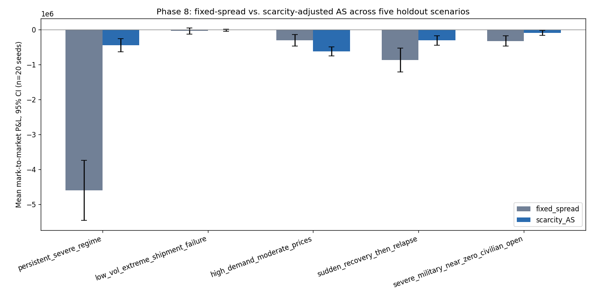
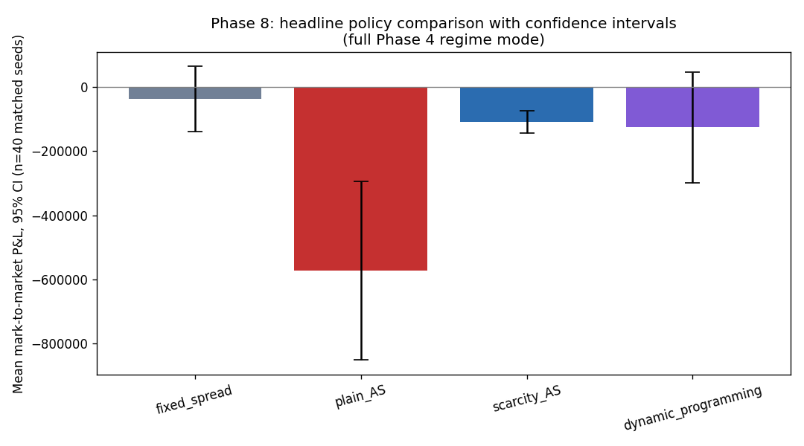

# Gallium Under Constraint

## Scarcity-Aware Dealer Quoting Under Gallium Supply Disruption

Gallium Under Constraint is a simulation-based research project that studies how a physical gallium dealer should quote customers and manage inventory when supply becomes delayed, unreliable, or politically restricted.

The project begins with a fixed-spread dealer and a standard Avellaneda-Stoikov model. It then extends the framework to account for physical inventory constraints, shipment failures, regime changes, clustered demand, military-linked orders, and the future value of preserving scarce inventory.

The main conclusion is conditional rather than universal. Scarcity-aware quoting performs especially well during persistent, supply-driven disruption, but it does not consistently outperform a simple fixed-spread policy under every form of market stress.



---

## Research Questions

1. **Does an Avellaneda-Stoikov-inspired physical-market policy outperform a naive dealer when gallium supply is disrupted?**
2. **Can price-based rationing protect military-linked demand on its own, or is an explicit priority rule required, and what is the cost of that protection?**

---

## Research Contribution

Traditional market-making models are designed for liquid financial markets with observable prices, continuous trading, and two-sided order flow. Physical gallium markets operate differently. Transactions are negotiated, inventory is slow to replenish, shipments can fail, and supply conditions are strongly affected by geopolitical restrictions.

Gallium Under Constraint adapts the logic of inventory-aware market making to this physical setting. The project makes three main contributions:

1. It separates physical, committed, available, in-transit, and expected inventory rather than treating inventory as one immediately usable quantity.
2. It extends the Avellaneda-Stoikov reservation price with bounded premiums for scarcity, replacement cost, shipment risk, existing commitments, and regime severity.
3. It evaluates whether pricing alone can protect military-linked demand, or whether a separate priority-allocation mechanism is necessary.

The result is not a forecasting or trading system. It is a structured decision model for studying dealer behavior under clearly stated assumptions.

---

## Project Summary

- **271 passing tests** across simulation, policy, statistical, sensitivity, and validation modules
- **Five quoting policies** and one separate military-priority allocation overlay
- **Four supply regimes:** Normal, Delayed, Severe, and Recovery
- **Four customer sectors:** Semiconductors, Defense and Aerospace, Telecommunications, and Solar and Clean Energy
- **Matched-seed Monte Carlo evaluation** with confidence intervals and paired tests
- **Five holdout scenarios** reserved for out-of-sample policy comparison
- **Nine policy ablations** and an **11-parameter sensitivity analysis**
- A complete assumptions register that classifies each major parameter as real data, an analogous-market estimate, an academic-model assumption, or a judgment call

All core research phases through statistical evaluation, sensitivity analysis, and validation are complete.

---

## Scope and Interpretation

Gallium is an opaque and thinly traded physical commodity. It does not have the public order book, comprehensive transaction tape, or dealer-level historical dataset available for liquid financial assets. This project therefore cannot estimate or backtest realized gallium-dealer profits using proprietary market data.

Instead, Gallium Under Constraint is evaluated through internal consistency checks, sensitivity analysis, simulated holdout scenarios, matched Monte Carlo comparisons, and qualitative comparisons with known supply disruptions.

Any statement that one policy outperforms another should be interpreted as:

> **Policy A outperforms Policy B under the simulation assumptions specified in this repository.**

It should not be interpreted as a claim about what a real gallium dealer would have earned.

The project is also more accurately described as **inventory-aware physical-commodity dealer quoting** than conventional two-sided electronic market making. Customer demand is modeled primarily on the buy side, while replenishment occurs through suppliers rather than customer sell orders. Avellaneda-Stoikov is therefore used as a theoretical foundation and adapted to a physical supply-chain setting. It is not presented as a literal model of a gallium limit-order book.

Supporting documentation:

- [`docs/assumptions_register.md`](docs/assumptions_register.md) records every material assumption, source type, justification, and expected sensitivity.
- [`docs/README_honesty_paragraph.md`](docs/README_honesty_paragraph.md) provides the complete scope and claims statement.
- [`docs/phase0_research_notes.md`](docs/phase0_research_notes.md) summarizes the public research used to construct the scenarios.

---

## Model Architecture

### Market Environment

The simulation combines the following components:

| Component | Implementation |
|---|---|
| Reference price | Mean-reverting jump-diffusion process with asymmetric positive shocks |
| Supply conditions | Four-state Markov regime process |
| Demand arrivals | Sector-specific Poisson and Hawkes order flow |
| Customer behavior | Order-size and willingness-to-pay distributions with price-sensitive execution |
| Military-linked demand | Per-order military classification with lower modeled price sensitivity |
| Physical supply | Lead times, full deliveries, partial deliveries, failed deliveries, emergency procurement, and nonlinear replacement cost |
| Inventory | Physical, committed, available, in-transit, and expected inventory tracked separately |
| Dealer accounting | Cash, realized P&L, mark-to-market P&L, terminal wealth, backlog penalties, and failed-delivery costs |

The separation between inventory states is essential. For example, 200 kilograms in transit with a 50 percent delivery probability is not economically equivalent to 100 kilograms already in the warehouse. Only physical inventory can satisfy a customer with certainty at the time of the quote.

### Policies Compared

| Policy | Purpose |
|---|---|
| Fixed spread | Naive baseline using a constant customer markup |
| Inventory heuristic | Simple threshold-based quote adjustment |
| Standard Avellaneda-Stoikov | Classical inventory-aware reservation price and spread |
| Scarcity-adjusted Avellaneda-Stoikov | Main policy, which adds physical-market risk premiums |
| Finite-state dynamic programming | Simplified policy that explicitly values preserved future inventory |
| Priority overlay | Separate non-price rule that attempts military-linked orders first during genuine stock contention |

---

## Scarcity-Adjusted Policy

The main policy begins with the standard Avellaneda-Stoikov reservation price and adds five bounded physical-market premiums:

```math
r_t^{\mathrm{physical}}
=
r_t^{\mathrm{AS}}
+ P_{\mathrm{scarcity}}
+ P_{\mathrm{replacement}}
+ P_{\mathrm{shipment\ risk}}
+ P_{\mathrm{commitment}}
+ P_{\mathrm{regime}}
```

Each premium represents a distinct source of physical-market risk:

- **Scarcity premium:** increases as freely available inventory approaches the safety buffer.
- **Replacement-cost premium:** reflects the increasing cost of replenishing inventory during disruption.
- **Shipment-risk premium:** increases when incoming supply becomes less reliable.
- **Commitment premium:** accounts for inventory that is already owed to customers.
- **Regime premium:** reflects the broader severity of the current supply environment.

The premiums are additive, capped, and non-negative. They raise the customer ask when physical supply risk increases.

The military-priority overlay is deliberately separate from the pricing rule. It changes fill order only when military-linked and civilian orders compete for limited physical inventory on the same day. This separation allows the project to compare pricing alone with pricing plus an explicit allocation rule.

---

## Evaluation Framework

Policies are evaluated using matched random seeds so that each policy faces the same underlying simulated environment as closely as possible.

The evaluation framework reports:

- Mean outcomes with 95 percent confidence intervals
- Paired policy differences and paired t-tests
- Tail-loss measures
- Overall, sector-level, and military-versus-civilian fill rates
- Shortage frequency and duration
- Holdout-scenario performance
- Component ablations
- One-at-a-time parameter sensitivity
- Mathematical relationship, edge-case, and qualitative plausibility checks

Price, demand, and regime random streams are matched across policies. Supply outcomes use reproducible seeded streams, but policies may place shipments at different times and in different quantities. Shipment events are therefore not perfectly paired one-for-one across all policies.

No headline policy comparison is treated as meaningful without uncertainty information.

---

## Main Results

### 1. Default Full-Regime Comparison

Across 40 matched seeds:

| Policy | Mean mark-to-market P&L | 95% confidence interval | Paired p-value vs. fixed spread |
|---|---:|---:|---:|
| Fixed spread | -$37,803 | [-$139,594, $63,988] | N/A |
| Standard Avellaneda-Stoikov | -$572,992 | [-$850,745, -$295,240] | <0.0001 |
| Scarcity-adjusted Avellaneda-Stoikov | -$109,545 | [-$144,428, -$74,663] | 0.141 |
| Dynamic programming | -$125,561 | [-$297,990, $46,868] | 0.031 |

The scarcity-adjusted policy has a lower point estimate than the fixed-spread baseline, but the paired difference is not statistically distinguishable from zero at 40 seeds. Standard Avellaneda-Stoikov materially underperforms because its calibrated spread is too narrow relative to physical replenishment costs.



### 2. Performance Depends on the Source of Stress

| Holdout scenario | Fixed-spread mean P&L | Scarcity-adjusted mean P&L | Better policy |
|---|---:|---:|---|
| Persistent Severe regime | -$4,599,300 | **-$448,737** | Scarcity-adjusted |
| Low volatility with extreme shipment failure | -$41,666 | **-$17,643** | Scarcity-adjusted, although both confidence intervals overlap zero |
| High demand with moderate prices | **-$306,610** | -$624,447 | Fixed spread |
| Sudden recovery followed by relapse | -$873,136 | **-$311,982** | Scarcity-adjusted |
| Military supply near zero with civilian supply open | -$325,556 | **-$93,123** | Scarcity-adjusted |

The scarcity-adjusted policy performs best when scarcity is caused by the risks it explicitly observes, including regime severity, shipment failure, and replacement cost. It performs poorly when scarcity is driven mainly by demand volume while those signals remain moderate.

The relevant conclusion is not that the model is always better during stress. Its advantage depends on whether the source of stress matches the risks represented in the pricing rule.

### 3. Shipment Reliability Is the Dominant Assumption

The 11-parameter sensitivity analysis identifies shipment reliability as the largest driver of mean P&L, with a total swing of approximately **$271,000**. This effect is more than twice the size of the next-largest sensitivity.


The ablation results support the same conclusion:

- Removing the **shipment-risk premium** reduces mean P&L by approximately **$45,329**, the largest effect of any individual premium.
- Removing the **scarcity premium** changes mean P&L by approximately **$4,460**.
- Removing the **commitment premium** produces no measurable effect at the default calibration.
- Removing all physical-market premiums and reverting to standard Avellaneda-Stoikov reduces mean P&L by approximately **$427,484**.

The premiums are most valuable as a combined physical-risk framework. Their joint effect is substantially larger than the effect of any single component.

### 4. Pricing Alone Protects Military-Linked Demand Under the Current Calibration

Before the priority overlay is applied, military-linked orders fill at approximately **47.5 percent**, compared with **18.3 percent** for civilian orders. This gap is produced by the modeled difference in price sensitivity.

The explicit priority overlay adds almost no aggregate benefit at the default calibration. Its fill-rate and P&L curves remain nearly flat across the full strictness range from `p = 0` to `p = 1`.


This is a meaningful null result. Conservative reorder logic keeps physical inventory high enough that genuine same-day contention between military-linked and civilian orders is rare. A queue-priority rule cannot have a large effect when there is little queue contention to resolve.

### 5. Adaptive Pricing Can Prevent the Shortage It Is Expected to Reveal

Under a regime held permanently in the Severe state, the scarcity-adjusted policy raises its average markup enough to reduce customer execution. Inventory therefore remains higher, and stockouts become less frequent than under Normal conditions.

This result initially appeared inconsistent with the expectation that Severe conditions should create more scarcity. The mechanism is price rationing. The policy responds to stress by reducing demand before physical inventory is exhausted.

The result is retained rather than recalibrated away because it reflects the endogenous behavior of the policy.

---

## Sector-Level Findings

The simulation includes four customer sectors with different demand intensity, order-size distributions, and military-linked shares.

Across matched simulations:

- Defense and Aerospace has the highest pooled fill rate because military-linked orders make up a larger share of its demand.
- Semiconductors, Telecommunications, and Solar and Clean Energy have lower and more similar pooled fill rates.
- Within every sector, military-linked orders fill at a higher rate than civilian orders.
- The priority overlay changes sector-level access only marginally at the default calibration because physical contention is uncommon.

These results describe simulated customers under assumed parameters. They are not estimates of real industrial production, economic loss, or sector-level shortages.

---

## Dynamic Programming Extension

The project also includes a finite-state dynamic-programming policy that explicitly compares immediate profit with the future value of preserving inventory.

The policy is solved by backward induction over a discretized state space consisting of inventory bins, regimes, and time. It is conceptually different from the other policies because it uses a precomputed action table rather than a closed-form quote.

At the current calibration, the dynamic-programming policy does not outperform the simpler scarcity-adjusted policy. Its internal transition model is intentionally simplified and does not fully represent the jump-diffusion price process, Hawkes demand, sector structure, or the complete supply chain.

This result provides an important modeling lesson: greater mathematical complexity does not guarantee better performance when the optimization model differs materially from the environment in which the policy is deployed.

---

## Research and Engineering Discipline

A central objective of the project is to make assumptions, failures, and null results auditable.

The repository includes:

- A complete assumptions register maintained throughout development
- Pre-registered ablation hypotheses written before the ablations were run
- Regression tests for bugs discovered through economically implausible outputs
- Explicit corrections when a point estimate failed a proper paired test
- Documented components that produced no measurable effect
- Tests showing how major components affect the simulation when removed
- Separate treatment of implementation validity, simulated performance, and real-world interpretation

Examples of corrected issues include:

- An unbounded replacement-cost function
- Reorder triggers that fired repeatedly during an existing shortfall
- Incomplete accounting for failed-delivery costs
- Mutation of shared scenario parameters across runs
- A reliability sensitivity override that initially had no effect in regime mode

These corrections are documented rather than hidden because they are part of the research process.

---

## Validation

The validation framework addresses three questions.

### 1. Do the mathematical relationships behave as intended?

Examples include:

- More inventory lowers the Avellaneda-Stoikov reservation price.
- Lower shipment reliability raises the shipment-risk premium.
- Lower available inventory raises the scarcity premium.

### 2. Do important edge cases collapse correctly?

Examples include:

- Perfect shipment reliability produces a zero shipment-risk premium.
- Zero Hawkes excitation produces Poisson-like demand variance.
- Zero military-linked share produces no military-linked orders.

### 3. Does the model respond plausibly under Severe conditions?

Most directional checks behave as expected. The exceptions are themselves informative. Higher scarcity premiums and more frequent stockouts do not always appear under Severe conditions because the policy raises prices and suppresses demand before inventory is depleted.

Historical events are used only as qualitative plausibility checks. The model is not calibrated to realized gallium prices, dealer transactions, or historical dealer profits.


---

## Repository Structure

```text
gallium-under-constraint/
├── README.md
├── requirements.txt
├── docs/
│   ├── assumptions_register.md
│   ├── README_honesty_paragraph.md
│   └── phase0_research_notes.md
├── src/
│   ├── price_process.py
│   ├── demand.py
│   ├── inventory.py
│   ├── accounting.py
│   ├── supply_chain.py
│   ├── regimes.py
│   ├── simulation.py
│   ├── sector_stress_test.py
│   ├── evaluation.py
│   ├── holdout_scenarios.py
│   ├── ablation.py
│   ├── sensitivity.py
│   ├── validation.py
│   └── policies/
│       ├── fixed_spread.py
│       ├── inventory_heuristic.py
│       ├── avellaneda_stoikov.py
│       ├── scarcity_adjusted_as.py
│       ├── priority_overlay.py
│       ├── dp_toy_example.py
│       └── dynamic_programming.py
├── tests/
└── results/
    └── figures/
```

The full phase-by-phase development record should be preserved separately in a file such as [`docs/development_log.md`](docs/development_log.md). The README is intended to present the final research question, methodology, results, and limitations without requiring the reader to reconstruct the project chronologically.

---

## Installation and Testing

```bash
git clone https://github.com/elena-ivosevic/gallium-market-making.git
cd gallium-market-making

python -m venv .venv
source .venv/bin/activate
# Windows: .venv\Scripts\activate

pip install -r requirements.txt
python -m pytest tests/ -v
```

The current test suite contains **271 passing tests**.

---

## Reproducibility

The simulation logic, assumptions, tests, and generated figures are versioned in the repository.

The remaining reproducibility limitation is that the full experiment suite is not yet consolidated into one command that regenerates every table and figure from raw seed-level results. A future release should add a command such as:

```bash
python -m experiments.run_all
```

That pipeline should save:

- Raw seed-level results
- Configuration files for every experiment
- Tables used in the research paper
- All generated figures
- A run manifest containing the code commit, package versions, and random seeds

The command above is a planned interface and is not currently implemented.

---

## Limitations

- The model is scenario-based rather than statistically calibrated to proprietary dealer data.
- There is no genuine customer sell-side order flow or active customer-facing bid.
- The regime transition matrix and several behavioral parameters are judgment calls informed by limited public evidence.
- Military-linked demand is represented through modeled price sensitivity and contract-like backlog behavior rather than observed procurement records.
- The dynamic-programming policy solves a simplified internal model that differs from the complete simulation environment.
- One-at-a-time sensitivity analysis does not identify interactions between parameters.
- Confidence intervals use a t-distribution approximation rather than bootstrap methods.
- Sector outputs describe simulated customers and should not be interpreted as estimates of real industrial production loss.
- Policy-dependent shipment decisions prevent shipment outcomes from being perfectly paired event-for-event across policies.
- The model studies one dealer and one commodity without explicit competitor behavior.

These limitations define the scope of the conclusions. They are not resolved simply by increasing model complexity.

---

## Next Steps

The highest-value next steps are focused on reproducibility and research communication rather than additional model complexity:

1. Consolidate all experiments into a single reproducible pipeline.
2. Save raw seed-level outputs and configuration manifests.
3. Add continuous integration for the complete test suite.
4. Convert the research notes into a citation-complete bibliography.
5. Write the accompanying paper around the central conditional finding: scarcity-aware pricing is most valuable when the source of scarcity matches the risks the policy is designed to observe.
6. Build a public results dashboard that presents policy comparisons, holdout scenarios, ablations, and sensitivity results without changing the underlying research claims.
